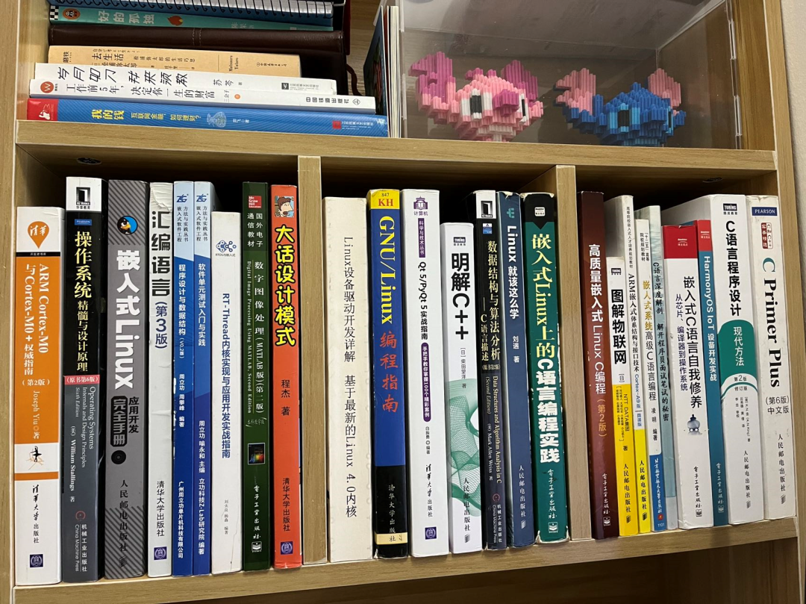

# 分享两点提高编程能力的建议！

## 1、温故而知新

技术发展，资料越来越多，我们不断学习新知识时，也要不断巩固一些曾经学过的知识。特别是一些很重要、而且之前掌握得不是很好但又很通用得知识。

**资料在精，不在多。**

往往有那么几本书，可以深深地影响着我们：

- 读了之后可以引发我们的兴趣
- 读了之后可以打通我们对某一块知识的理解
- 读了之后可以提高我们的认知
- 读了之后能让我们快速入门

……

如果你还没有这么几本书，那可能是读的书还不够多，还没遇到。

类似这样的书，有很多。一开始可能因为我们的知识体系构建得还不够完善，导致我们并不能全部参悟，所以可以多读几遍。

就比如我们读中学得时候，再去看小学的知识的时候，就感觉简单很多。

那是因为我们的知识体系在不断完善，这时候再尝试去看一些之前学不懂的知识，可能就看懂了。但也可能还是看不懂，需要继续积累知识。

经常有小伙伴问我推荐嵌入式相关资料。

其实，每个人的情况都不一样，我推荐的也不是最合适你的，需要你自己去尝试阅读、自己差不多能看得进去、学得懂的，那这个资料才是适合当前阶段的你。

比如：

有些人看得懂《啊哈C语言》、有些人看得懂《C陷阱与缺陷》；

有些人看得懂正点原子的STM32教程、有些人看得懂安富莱、野火的STM32教程，比如我，一开始是看安富莱的STM32教程的，因为当时学校买的开发板就是安富莱开发板，但是我也是刚开始学，看得很懵，但现在看来，人家这教程做得太好了！

有些人看得懂正点、野火的嵌入式Linux教程，有些人看得懂韦老师的嵌入式Linux教程等等。

有些答主大佬可能会贬低某些资料、教程，其实没必要，很多时候那些被贬低的才是最适合初学者的。

> 咱们嵌入式大杂烩公众号专注于嵌入式技术，主要专注于嵌入式基础知识的分享。

下面简单推荐一些比较大众的嵌入式资料，大家可自己去尝试阅读。

### （1）开发板配套教程

首先，第一手很重要的资料就是各大开发板的配套教程，有单片机裸机的、有RTOS、也有嵌入式Linux。

以下排名不分先后，各有各的特点。

- 安富莱

> https://www.armbbs.cn/forum.php?mod=forumdisplay&fid=49

- 百问

> http://download.100ask.org/

- 野火

> https://doc.embedfire.com/products/link/zh/latest/index.html

- 正点原子

> http://www.openedv.com/thread-13912-1-1.html

- 讯为

> http://bbs.topeetboard.com/forum.php

### （2）纸质书籍

对我影响深远的一些书：

书名就不打了，看图吧，手累

## 2、思考+重构

我们多重构自己的代码或者别人的代码，也是可以自我提高的。

我在工作中，有过几次重构经历，有模块重构、也有整个工程的重构。每次做完，都感觉收获颇丰。

重构时，我们会去思考模块设计的不足：

- 逻辑是否有漏洞
- 模块是否高内聚
- 是否与其它模块有较强的耦合
- 是否方便维护与扩展
- 分层是否合理
- 是否有冗余代码
- 编码是否规范
- 命名是否清晰
- 注释是否完善
- 是否还有更好地实现方法
- 是否有与其它模块公用一些数据
- 各模块交互的数据能否更简练

……

重构是一件很爽的事情。但在工作中，往往这种机会是非常少的，珍惜每一次可以重构的机会。

公司里，可能有如下两种情况才会有可能重构：

- 现有方案确实漏洞太大了，再如何完善都不能根本性地解决问题，这时候可能会重新梳理、梳理新地解决方案、然后大改。
- 项目更新迭代时，这时候可能会涉及到多个模块地修改，这时候就有重新梳理、重构的机会。

否则，只要程序能跑，大多数情况下都不会轻易地大改。

如果，工作中没有这样的机会。那也可以从自己的日常学习入手，比如平时业余时间写的代码啊，或者技术博客啊。

以前写的代码或者技术博客，现在再去看，可能又会发现很多地不足之处，可以不断地修改完善。

