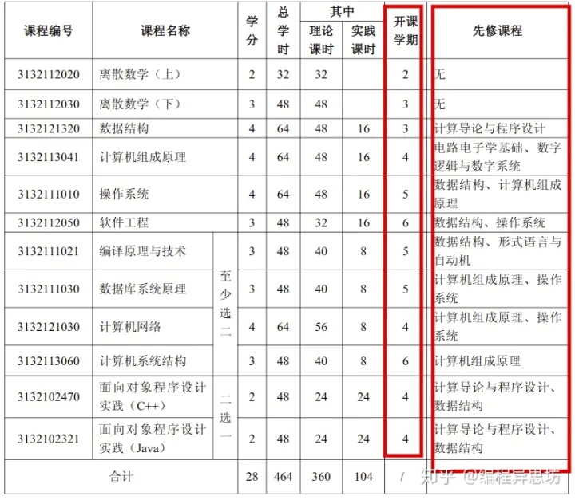
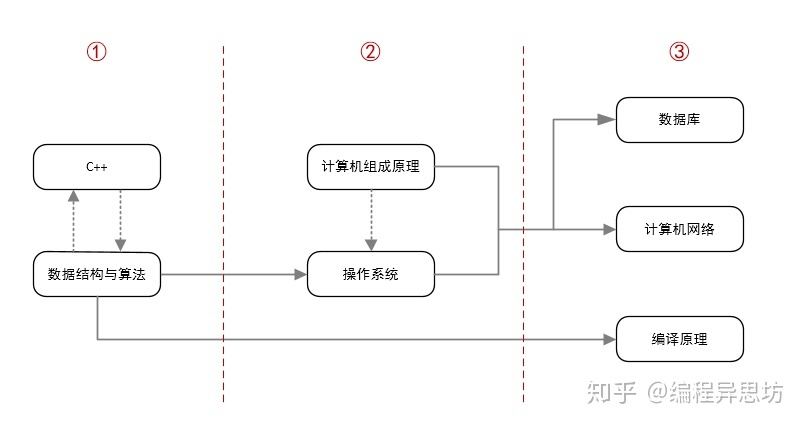
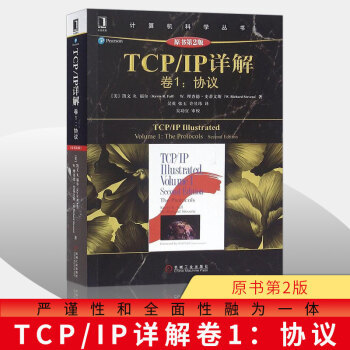
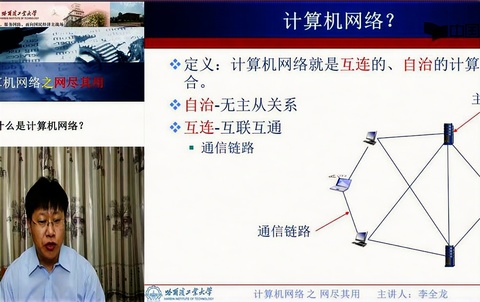
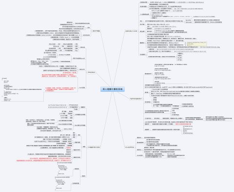

这篇文章适用人群：

1. **非科班自学编程的学生或者在职人员**
2. **科班还在迷茫期的大学生**
3. **考研党(有一定的借鉴意义)**

看完这篇文章能解决的问题：

1. **能够知道计算机专业课程合理的学习顺序**
2. **能够获得各门课程的书籍推荐和视频资源**
3. **能够掌握各门课程的学习重点**
4. **能够了解各门课程在就业方面所占比重**

## 一、计算机专业课程学习顺序

这种问题一般公说公有理婆说婆有理，很难达成统一意见。这时候就需要找一个权威专家来镇镇场子了。那谁最权威呢？

当然是计算机强校的课程大纲啦！高校的目的就是培养人才，它们的课程大纲是高校的教授在充分考虑到学生的实际情况制定的，自然最具有权威性。

下面我放一张**北京邮电大学**(计算机强校)**计算机科学与技术专业**的培养计划课程安排表：

这张图只需注意红色方框的部分，一个是修课时间，另外一个是先修课程。

这张图看起来不是很直观，我做了一张图便于大家理解。

这张图我是根据课程表的先修课程这一栏进行优化改进得到的，毕竟学校集体学习和自学还是有些差异，所以要做些适当的改动，但是大方向是没有变的。

从图中可以看出，计算机这几门专业课我把它们划分成了三个部分。学习顺序**从前往后**分别为①——②——③，**①②③内部可以一起学习**。

**第一部分：C++、数据结构与算法可以同时进行学习。**

**第二部分：操作系统是以计算机组成原理、数据结构与算法为基础，所以可以先学计算机组成原理，然后学操作系统。**

**第三部分：数据库、计算机网络这两门课以计算机组成原理、操作系统为基础，可以同步学习。编译原理可以单独学。**

## 二、专业课资源推荐和学习建议

**１．课程：C++**

《C++ Primer》

视频推荐：

[C++面向对象高级编程（侯捷）_哔哩哔哩 (゜-゜)つロ 干杯~-bilibiliwww.bilibili.com/video/BV14s411E772?from=search&seid=423797260819168621](https://link.zhihu.com/?target=https%3A//www.bilibili.com/video/BV14s411E772%3Ffrom%3Dsearch%26seid%3D423797260819168621)

《[Effective C++](https://www.zhihu.com/search?q=Effective%20C%2B%2B&search_source=Entity&hybrid_search_source=Entity&hybrid_search_extra=%7B%22sourceType%22%3A%22answer%22%2C%22sourceId%22%3A1331073476%7D)》

**学习建议：**

《[C++ Primer](https://www.zhihu.com/search?q=C%2B%2B%20Primer&search_source=Entity&hybrid_search_source=Entity&hybrid_search_extra=%7B%22sourceType%22%3A%22answer%22%2C%22sourceId%22%3A1331073476%7D)》先看，看到**第16章**(模板与泛型编程)就够用了，后面如果时间不充裕可以选择不看。**第7章**(类)往后章节可以配合视频教程学习，效果会比较好。前7章是基础，后半部分才是C++重点，也是拉开差距的分水岭。

《Effective C++》等看完《C++ Primer》，对C++有了整体的认识后再看。这本书总结了一些C++开发过程中的易错点，值得细读。

C++的**实践**部分可以和《[数据结构与算法](https://www.zhihu.com/search?q=%E6%95%B0%E6%8D%AE%E7%BB%93%E6%9E%84%E4%B8%8E%E7%AE%97%E6%B3%95&search_source=Entity&hybrid_search_source=Entity&hybrid_search_extra=%7B%22sourceType%22%3A%22answer%22%2C%22sourceId%22%3A1331073476%7D)》结合起来练习，用C++来实现各种数据结构，既巩固了算法又巩固了语言。C++和数据结构与算法是同步进行学习的。

**２．课程：数据结构与算法**

《[数据结构与算法分析](https://www.zhihu.com/search?q=%E6%95%B0%E6%8D%AE%E7%BB%93%E6%9E%84%E4%B8%8E%E7%AE%97%E6%B3%95%E5%88%86%E6%9E%90&search_source=Entity&hybrid_search_source=Entity&hybrid_search_extra=%7B%22sourceType%22%3A%22answer%22%2C%22sourceId%22%3A1331073476%7D)－C++语言描述》

视频推荐：

[数据结构_浙江大学_中国大学MOOC(慕课)www.icourse163.org/course/ZJU-93001](https://link.zhihu.com/?target=http%3A//www.icourse163.org/course/ZJU-93001)

**学习建议：**

要善于利用 C++ STL 标准库来实现各种算法，方便快捷。通读全书，配合视频效果更佳。如果觉得课后题太少或者不想做，可以到 Leetcode 上刷题，按照标签刷。

[题库 - 力扣 (LeetCode)leetcode-cn.com/problemset/all/](https://link.zhihu.com/?target=https%3A//leetcode-cn.com/problemset/all/)

**３．课程：计算机组成原理**

《深入理解计算机系统》

视频推荐：

[【精校中英字幕】2015 CMU 15-213 CSAPP 深入理解计算机系统www.bilibili.com/video/BV1iW411d7hd?from=search&seid=13353650717207742800d?from=search&seid=13353650717207742800](https://link.zhihu.com/?target=https%3A//www.bilibili.com/video/BV1iW411d7hd%3Ffrom%3Dsearch%26seid%3D13353650717207742800d%3Ffrom%3Dsearch%26seid%3D13353650717207742800)

**学习建议**：

这本书可以不全看，重点章节是**第2、3、6、８、9、12章**，如果觉得时间紧，其他章节可以不看。不要仅仅看书，那样很难学懂，要配合下面的配套实验一起做理解才能深刻！！！

[CSAPP配套实验github.com/Exely/CSAPP-Labs](https://link.zhihu.com/?target=https%3A//github.com/Exely/CSAPP-Labs)

**４．课程：操作系统**

《[现代操作系统](https://www.zhihu.com/search?q=%E7%8E%B0%E4%BB%A3%E6%93%8D%E4%BD%9C%E7%B3%BB%E7%BB%9F&search_source=Entity&hybrid_search_source=Entity&hybrid_search_extra=%7B%22sourceType%22%3A%22answer%22%2C%22sourceId%22%3A1331073476%7D)》

现代操作系统（原书第4版）

视频推荐：

[操作系统原理(哈工大 )www.bilibili.com/video/BV1d4411v7u7?from=search&seid=9067503727200252128](https://link.zhihu.com/?target=https%3A//www.bilibili.com/video/BV1d4411v7u7%3Ffrom%3Dsearch%26seid%3D9067503727200252128)

发现哈工大的操作系统讲的更好，里面配套的实验超级棒！！！全部做完操作系统就学通了，起码不会仅仅是背书的水平了。

[操作系统原理与实践_Linux - 蓝桥www.lanqiao.cn/courses/115](https://link.zhihu.com/?target=https%3A//www.lanqiao.cn/courses/115)

**５．课程：计算机网络**

《[计算机网络自顶向下方法](https://www.zhihu.com/search?q=%E8%AE%A1%E7%AE%97%E6%9C%BA%E7%BD%91%E7%BB%9C%E8%87%AA%E9%A1%B6%E5%90%91%E4%B8%8B%E6%96%B9%E6%B3%95&search_source=Entity&hybrid_search_source=Entity&hybrid_search_extra=%7B%22sourceType%22%3A%22answer%22%2C%22sourceId%22%3A1331073476%7D)》

计算机网络：自顶向下方法(原书第7版)

《TCP/IP 卷一》

TCP/IP详解 卷1 协议 卷一

视频推荐：

[哈尔滨工业大学 计算机网络_哔哩哔哩 (゜-゜)つロ 干杯~-bilibilib23.tv/eeA2CI](https://link.zhihu.com/?target=https%3A//b23.tv/eeA2CI)

**学习建议：**

《计算机网络自顶向下方法》这本书相比于其他计算机网络书籍较通俗易懂，学习起来应该不太费劲。这本书重点章节是**第2、3、4、5、6章**，其他章节可以跳过。

《TCP/IP 卷一》经典书籍，也是需要反复阅读的一本书。计算机网络需要多实践才能理解其中奥秘，否则书看了也白看。后面会推荐一个项目来巩固计算机网络的知识。

[《TCP/IP详解 卷1:协议》哪些章节需要重点阅读？862 关注 · 25 回答问题](https://www.zhihu.com/question/53283819)

**６．课程：数据库**

《MySQL必知必会》

MySQL必知必会

视频推荐：

[MySQL 基础+高级篇- 数据库 -sql -尚硅谷www.bilibili.com/video/BV12b411K7Zu?from=search&seid=5909982064293430782](https://link.zhihu.com/?target=https%3A//www.bilibili.com/video/BV12b411K7Zu%3Ffrom%3Dsearch%26seid%3D5909982064293430782)

**学习建议：**

多实践，就是干！！！

**７．课程：编译原理**

《编译原理》

编译原理（第2版）

视频推荐：

[编译原理（哈工大）www.bilibili.com/video/BV1zW411t7YE?from=search&seid=11631273910877958758](https://link.zhihu.com/?target=https%3A//www.bilibili.com/video/BV1zW411t7YE%3Ffrom%3Dsearch%26seid%3D11631273910877958758)

**学习建议：**

这门课过过就行，不用太深究，平常也比较难用到，但用到就真的有大用。

[如何学习编译原理？4580 关注 · 62 回答问题](https://www.zhihu.com/question/21515496)

**８．实践项目推荐：**

[TinyWebServer开发github.com/qinguoyi/TinyWebServer](https://link.zhihu.com/?target=https%3A//github.com/qinguoyi/TinyWebServer)

**建议：**

这个项目是某位大佬根据《[Linux高性能服务器编程](https://www.zhihu.com/search?q=Linux%E9%AB%98%E6%80%A7%E8%83%BD%E6%9C%8D%E5%8A%A1%E5%99%A8%E7%BC%96%E7%A8%8B&search_source=Entity&hybrid_search_source=Entity&hybrid_search_extra=%7B%22sourceType%22%3A%22answer%22%2C%22sourceId%22%3A1331073476%7D)》这本书搭建的一个小型项目，里面会用到上面所有课程的知识，做完后一定会有非常大的收获的。

## 三、各门课程在就业方面考察的比重

最终我们都会走向职场，所以面试考察的重点也是我们关心的。在面试所占比重中，第一梯队>第二梯队>第三梯队。

第一梯队：数据结构与算法、编程语言、计算机网络

第二梯队：操作系统、计算机组成原理

第三梯队：数据库、编译原理

[全部课程面试知识点总结github.com/huihut/interview](https://link.zhihu.com/?target=https%3A//github.com/huihut/interview)

最后推荐一个 Github 项目，号主把大学课程的面试知识点分门别类整理出来，方便大家查漏补缺。

看了一些知友的评论，发现很多知友都不知道如何阅读这些计算机大部头的书籍，为此我专门写了一个如何阅读计算机书籍的回答，可以点击以下链接查看。看了一些知友的评论，发现很多知友都不知道如何阅读这些计算机大部头的书籍，为此我专门写了一个如何阅读计算机书籍的回答，可以点击以下链接查看。

[如何系统有效地阅读原理类的计算机书籍，如《深入理解计算机系统》与《深入理解 Java 虚拟机》等？175 赞同 · 2 评论回答](https://www.zhihu.com/question/394709785/answer/1366779711)

