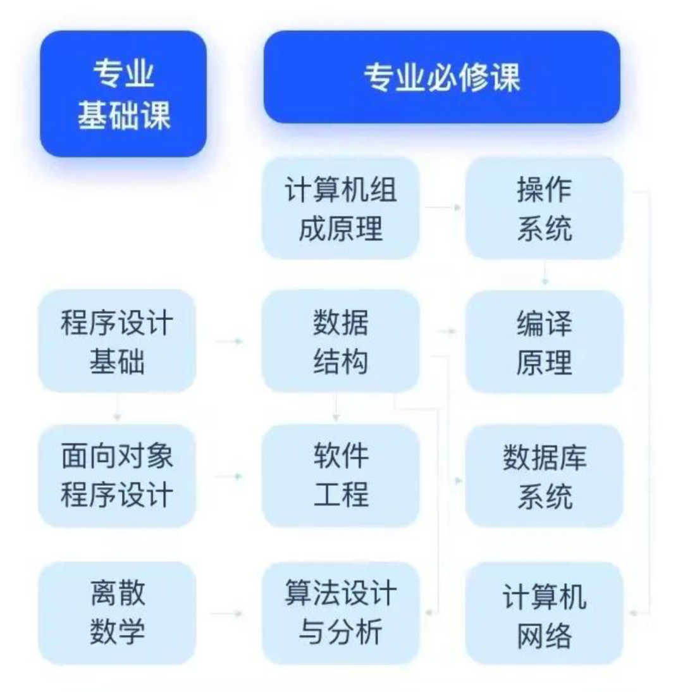
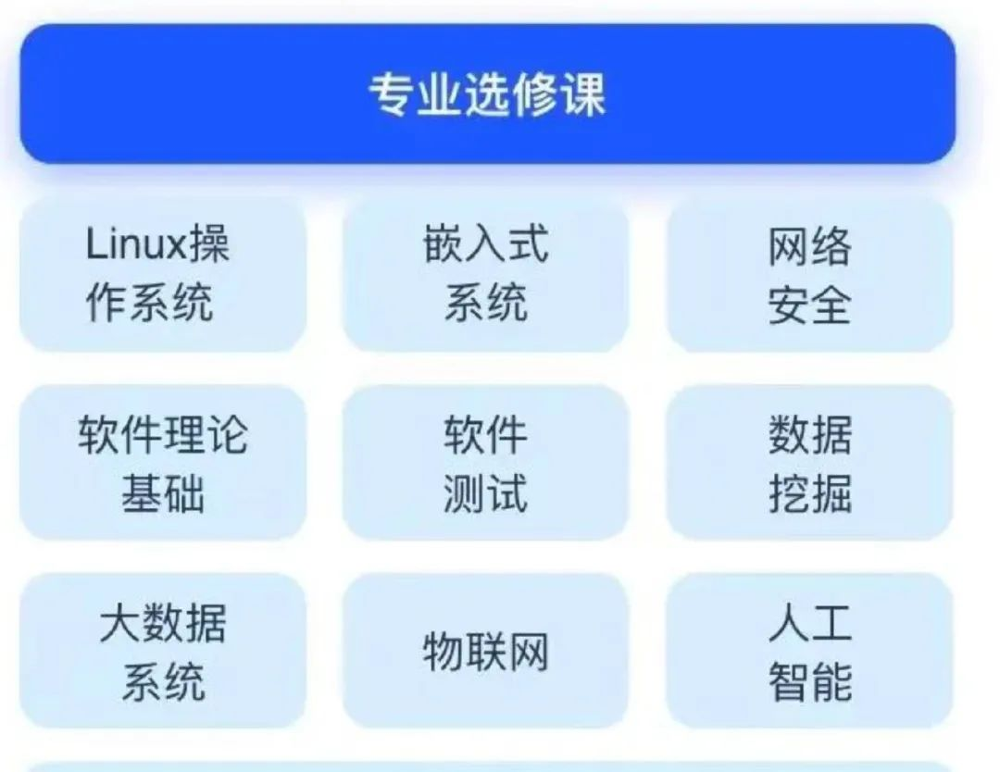

大家好，我是小北。

由于经常写一些编程、计算机相关的学习路线的文章，比如 C++ 的、操作系统的等等。

近期，收到一些小伙伴的私信，想让我讲一下计算机专业应该怎么学。

包括还有非科班转码找工作、非计算机专业考研计算机想补齐 CS 本科课程的同学。

今天，我就来说说计算机专业的学习路线，给想入门计算机或者想夯实自己基本功的小伙伴们一些参考。

按照国内高校CS专业的学习内容和课程安排，把要学的科目做了个简单分类，基本可以分为：基础课、必修课和选修课这三部分。

其实看着很多，概况起来就是（下面只涉及CS专业课）：

1. **计算机导论 + 编程入门语言(推荐C + Java)**
2. **算法与数据结构**
3. **操作系统**
4. **计算机网络**
5. **数据库系统**
6. **深入理解计算机系统**( ps: 教材是CSAPP，这是我本科上过最值的课！System Programing
7. **编译原理**
8. **特定领域，如：计算机图形学、AI、安全、System方向、分布式等等**

排在越前面的是越应该学习掌握的， 1-6 我觉得是任何方向同学都应该学习的，7-8 可以根据兴趣和需要选择学习。

学习的途径就是：

多看国内外 CS 名校的一些开放课程 + 看经典的书 + 多写代码！！！

毕竟现在 MOOC、Udemy、B站（学习区） 上学习的资源都是很丰富的。

分类列举几个课程：

### 一、计算机导论

首先建议从计算机导论课程开始，推荐下面这些课程：

- Harvard的CS50  **CS50: Introduction to Computer Science** ：https://online-learning.harvard.edu/course/cs50-introduction-computer-science?delta=0
- Berkeley的CS61A  **CS 61A: Structure and Interpretation of Computer Programs** : https://cs61a.org/
- MIT的6.001  **mit-6.001**https://ocw.mit.edu/courses/electrical-engineering-and-computer-science/6-001-structure-and-interpretation-of-computer-programs-spring-2005/

### 二、C 语言

随后建议学习一门语言，可以是 C、Java、或 Python，我推荐 C语言（当然，也可以是Python！这不是重点，重点是要多去写，入门时提高对编程的兴趣），提到C语言，我这里推荐国内浙大翁凯老师的课，看过的都说好~

分为两门，第一门是面向高考结束想提前自学一点编程的，叫大学先修课：

- C语言程序设计CAP-大学先修课 : https://www.icourse163.org/course/ZJU-1001614008

虽然叫先修课，但是覆盖了C语言的主要知识点，也适合大一新生~

第二门是

- **C语言程序设计进阶** ：https://www.icourse163.org/course/ZJU-200001

会带你用C语言完成一些有趣的项目，比如一些图形界面小游戏，先修课学习 C 语言语法基础，进阶课带你项目实操，搭配使用，你就是同学中的大神！

有了语言基础之后建议学数据结构与算法：

### 三、数据结构推荐：

- Stanford CS106系列
- **CS106A: Programming Methodologies** : http://web.stanford.edu/class/cs106a

### 四、算法推荐：

- 6.046（进阶）  **Design and Analysis of Algorithms - MIT** ：http://courses.csail.mit.edu/6.046
- MIT的6.006  **Introduction to Algorithms** ：https://ocw.mit.edu/courses/electrical-engineering-and-computer-science/6-006-introduction-to-algorithms-fall-2011/
- Coursera上的Princeton课程
- Berkeley的CS61A 和 CS61B

### 五、操作系统推荐：

- CMU的15-213
- Berkeley的CS162，

这两个都是有视频有lab的好课

还有一个非常经典的 MIT 6.828，附带一个xv6 lab

课程：6.828: Operating System Engineering

### 六、 组成原理、体系结构:

1. MIT的6.004,
2. CMU的15-213
3. Berkeley的CS61C

### 七、计算机网络：

- Stanford的 CS144，lab 很有意思
- 国内如果是学习计网理论的话，可以看哈工大的课程，或者 B 站《计算机网络微课堂》

本科阶段把上面这几门课学好了，做一两个项目，算法题多刷一刷，校招就会容易很多。

不要忽视了基础，大学是最该打基础的时候。

那么如何检验学得如何呢？多问自己一些 Why 的问题，就会发现有些看似懂了的地方，细节一挖就说不清楚了，那么这就是需要学习的地方。

比如，想必你一定听说这个计网面试题：

“从 URL 输入到页面展现到底发生什么？" 说实话，这个问题涵盖了太多内容，包括服务器处理、DNS、计算机网络几层链路、浏览器渲染等等。

还有类似「一个数据包是如何发送到另外一台电脑的」，如果你能完整的说出整个过程，那么计网你一定是学懂了！

这就是为啥面试这么喜欢问这个问题的原因。

又比如 “从代码被写下到程序运行起来到底发生了什么？”

这个问题回答得越详细越好，基本上能说清，你就理解了编译原理、操作系统、组成原理这三座大山。

路线很清晰，剩下的花时间干就完了，冲！