#  学习计算机基础有什么推荐的书？

之前有读者问我，学习计算机基础有什么推荐的书？

这一个我就很有心得了，因为我大学的专业并不是计算机专业的，是电气自动化专业的，所以学校的课程并没有操作系统、计算机网络、计算机组成、数据库这类课程，但是还是会有编程课。

所以，计算机基础这些课程都是我自学过来的，期间看过了很多的书，也在中国慕课和 B 站刷过很多视频，踩过不少的坑。

**其实在自学过程中，最容易踩坑的地方就是不看自己当前水平，盲目跟风买那些豆瓣高分的大而全的计算机黑皮系列的书，然后学几天，就放弃了。**

这些大而全的计算机黑皮书当然很经典，但是它们并不适合新人入门学习，因为这类书籍的内容都充满大量的专业术语，我们人在看到陌生又难以理解的词汇时，就会感觉很吃力，脑子看着就会很累，就会驱使你做简单和快乐的事情，比如睡觉、刷短视频、玩游戏。。。

不要问我，为什么知道的那么清楚，因为我就是这么踩坑过来的。

所以，我认为**学习一门学科的时候，要从最基础的书开始学起，接着搭配视频快速入门，然后再渐渐步入到这些大而全的计算机黑皮书**。

关键的问题来了，计算机基础有哪些入门的基础书和视频呢？

接下来，我就跟大家分享下，我看过的书和视频，都是**从入门再到进阶的路线。**

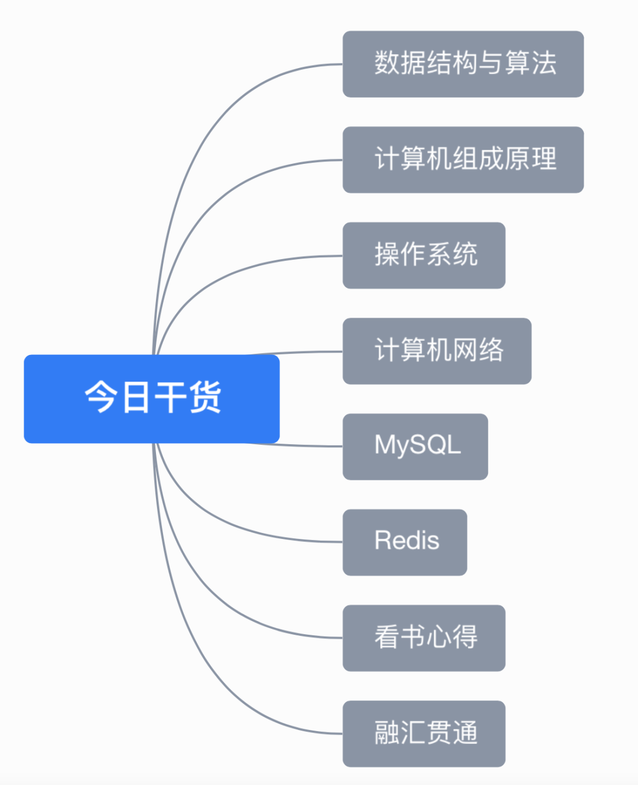

## 一、数据结构与算法

很多人同学在大一的时候，就学会了一门编程语言，大概率都是 C 语言，有了一定的编程能力，就可以开始学习数据结构与算法。

数据结构与算法这方面的话是非常非常非常重要的，想要冲大厂的同学们如果这方面不过关可能连笔试都过不去，更别谈面试的手撕算法了。

- **算法：**动态规划、回溯算法、查找算法、搜索算法、贪心算法、分治算法、位运算、双指针、排序、模拟、数学、……
- **数据结构：**数组、栈、队列、字符串、链表、树、图、堆、哈希表、……

### 数据结构学习

首先推荐《**大话数据结构**》这本入门级别的书，因为书里的内容都是大白话，而且还图文并茂，读起来还是很顺畅的。

然后视频推荐《**浙江大学的数据结构**》课程，在 B 站就能搜索到，课程是老师带大家用 C 语言来实现各种常见的数据结构。


现在大多数高级语言都会有容器，就是把一些常见的数据结构封装成了容器，然后使用起来就比较方便，但是不利于我们理解底层的数据结构是怎么变换和操作的，所以这门课还是很有意义的。

如果想要实战的话，可以去 Leetcode 官方出品的免费教程 Leetbook，网站很细心的按照各个知识点循序渐进地罗列了出来。讲解知识 + 实战演练，学习起来会比看书效率高。


### 算法学习

之前有位校招去字节的读者分享过他的算法学习心得，我觉得写的不错，这里我就直接贴出来。

在我看来，笔试能力在校招中要占据 60% 的重要程度。

首先笔试不过，你根本没有面试的展示机会。其次面试中也会反复让你手写代码，以字节为例，每一轮面试都是1-2道编程题，有时候不怎么聊简历；百度每一轮面试有一道编程题。现在公司的面试模式就是这样，如果代码没搞出来，大概率会被淘汰。

并且最窒息的是这些代码题都不简单，一般都是 leetcode中等到hard难度。

刷题主要可从以下三个渠道。

第一个，剑指offer：

*https://www.nowcoder.com/ta/coding-interviews*


第二个，leetcode:

*https://leetcode-cn.com/problemset/algorithms/*

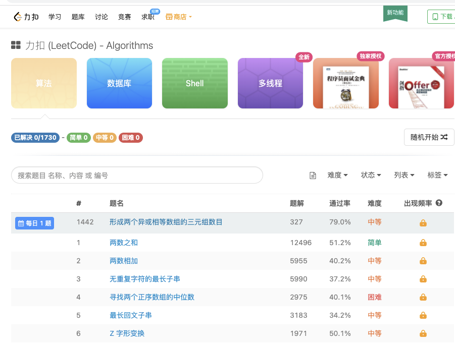

第三个，近期面试中常考题：

*https://www.nowcoder.com/activity/oj*

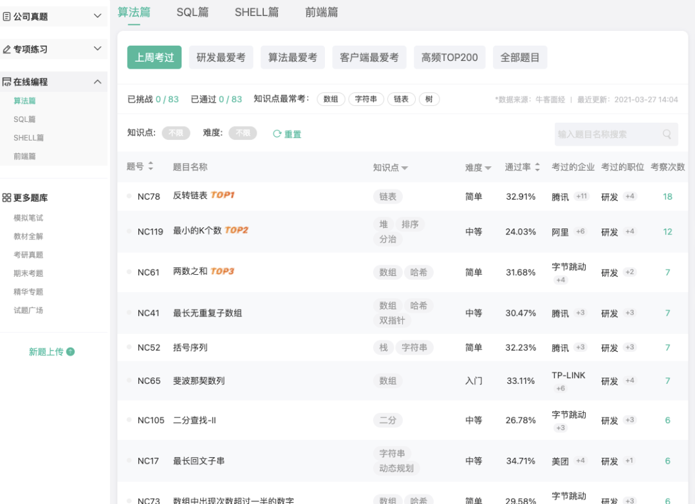

《剑指 offer》作为大经典，是一定要刷两遍以上的，很多题都是面试时的原题，里面包含了很多笔试常用的思想方法，反复看，反复研。

我一开始每天 10 题，过两遍以后，要求自己每天快速过剑指一遍。

leetcode 由于题目十分之多，刷完是不可能的。我的意见是 leetcode 作为你弱项的专项练习。

leetcode 右侧有标签分类，如下图：

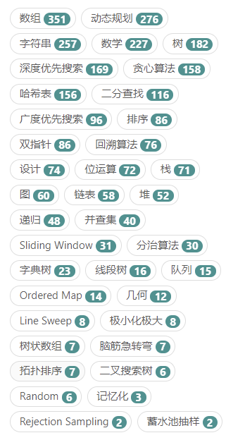

另外在巩固完弱项的情况下，建议将 leetcode 前 300 题刷熟练，据我个人面试经历，国内大厂面试出的代码题 80% 都是这个范围内的。

另外，我在刷题的时候看了 labuladong 总结的算法小抄，对算法的理解很有帮助。

最后根据我的面试经历，根据个人感觉，公司常考题有：

- 链表类（链表反转类题目）
- 二叉树类（二叉树的遍历类型题，最大公祖先类题目）
- 字符串操作题目
- dfs/bfs
- 动态规划（这个考的基本都是 leetcode 上的或者是背包问题，对于动态规划问题其实有很多种类，比较见到的就是一维动态和二维动态），另外还有区间调度类型的题目（贪心算法，也属于动态规划的一种特殊情况。

其实也没有什么技巧，多刷题，多理解就好了。

## 二、计算机组成原理

计算组成原理确实是分为两个方向，一个是硬件电路的，一个是软件程序的。

我自己本身是干开发的，所以我这次分享的机组资料是跟软化程序有关的，也就是不会涉及到硬件电路的东西，即使你不会数字电路、微机原理也是可以直接学习的。

### 入门学习

先极力推荐 b 站的《**计算机科学速成课**》，这个课程是国外录制的，内容真的是好，视频的动画很精美，讲课的时候不会很死板，反正就是不看后悔、相见很晚系列。


**对于入门计算机组成，可以先看前 10 个视频**，看完这 10 个视频也就不到 2 个小时，看完前 10 个视频对计算机的工作方式就有一个基本的了解了。

看完前 10 个视频就可以开始看书了。

讲真，不太建议小白一上来就看那些厚的不行的计算机组成原理的黑皮书，这些书是经典的没错，也正是由于它们是经典的，所以这些书的知识体系很全、很多、很厚。

但是这样很容易让初学者迷失在里头，可能刚兴致勃勃看几十页就放弃了，于是这些厚的不行的书就成为了你们的**垫书神器**，**知识没学多少，颈椎病倒是治好了。**

对于初学者，我推荐两本书《**计算机是怎么样跑起来**》和《**程序是怎么跑起来的**》，这两本很薄而且图文并茂，作者都是用大白话的方式来阐述知识，这点对初学者非常友好。

这两本不用 1 个月就能看完，因为在看这两本书的时候，你会看的很顺畅，相比学习的心态，你更多的是会带着「好奇心」的心态去读。

其中**《程序是怎么跑起来的》是一个「微缩版本」的计算机组成原理**，你可以只选择看这一本，从这本书的名字也可以知道，它是从计算机是怎么运行程序的视角来讲的，然后把涉及到的计算机硬件和它们之间是如何协作的一点一点的给大家带出来，让大家能瞬间明白这些计算机硬件的作用。

这本仅仅是入门级别，主要的作用是让初学者明白计算机组成原理这门课是学什么的，以及梳理主要的知识体系，用了这本书的概念后，在去深入计算机组成的时候，就不会雨里雾里的。

另外，《**编码：隐匿在计算机软硬件背后的语言**》这本书也很不错，是本**科普类的书**，非常适合非科班的同学，主要讲是计算机工作的原理（二进制编码、加减法运算、计算机部件、浮点数定点数、处理器等），也就是跟计组息息相关的知识，它的内容很有趣味性，并不想教科书那样晦涩难懂，丝毫不会让你感到生硬，读起来很畅快。

### 深入学习

想要深入学习计算机组成原理的同学，我首先推荐《**计算机组成与设计：硬件 / 软件接口**》这本书，

这本书确实很厚，差不多 500 多页，但是**书从来没有人规定一定要从头读到尾，一页页的读的。**重要的不是看完一本书，而是从书上学到多少，解决了什么问题。

大家可以挑这几个章节看，跟开发者关系比较大的章节：

- **第一章：计算机抽象以及相关技术**，这个章节主要是介绍了计算机组成的思想，可以简单快读看，不用重点读；
- **第二章：指令**，大体上讲的是计算机是如果识别和运行指令的，以及代码到指令的过程；
- **第三章：计算机的算数运算**，介绍的是计算机是如何进行加减乘除法的，以及浮点数的运算；
- **第五章：层次化存储**，讲的是计算机的存储层次结构，而且重点讲的是 CPU Cahe。

看书觉得很累，也可以结合视频一起看，这里推荐**哈工大的《计算机组成原理》视频**，在 b 站就可以直接看，大家自己去搜索就可以。

**看书和看视频可以相互结合的，比如你看视频看了计算机指令的内容，然后你可以不用继续往下看，可以回到一本书上，看书上对应这个章节的内容，这是个很好的学习方法，视频和书籍相辅相成。**

你要是觉得哈工大的计组课程太难，你可以看**王道考研的计算机组成原理的视频课程**，同样 b 站就可以看。这个视频虽然是针对考研的，但是也是可以作为学习计组的资料，讲的内容不会太深，适合你快速建立计算机组成原理体系，和梳理计组知识的脉络。

另外，在推荐一本《**深入理解计算系统**》这本书，人称 CSAPP。

可能大家以为这本书是讲操作系统的，我最开始也以为是这样。后面当我开始啃这本书的时候，发现我大错特错，它远不止我想的那样。

这本书是从程序员的角度学习计算机系统是如何工作的，通过描述程序是如何映射到计算机系统上，程序是如何执行的，以及程序效率低下的原因，这样的方式可以让大家能更好的知道「程序与计算机系统」的关系。

CSAPP 涵盖的内容非常多，有**计算机组成 + 操作系统 + 汇编 + C语言 + Linux系统编程**，涉猎的领域比较多，是一本综合性的书，更是一本程序员修炼内功的指引书。

CSAPP 主要包括以下内容：

- 信息表示（如何使用二进制表示整型、浮点数等）；
- C 和汇编语言的学习（通过汇编语言更深入地理解C语言是什么）；
- 计算机体系结构（存储层次结构、局部性原理、处理器体系结构）；
- 编译链接（C语言如何从文本变成可执行文件、静态链接、动态链接）；
- 操作系统的使用（异常控制流、虚拟内存、多个系统调用介绍）；
- 网络及并发编程（并发的基本概念、网络相关的系统调用的介绍）。

你会发现有部分内容和《**计算机组成与设计：硬件 / 软件接口**》这本书重合了，**重合的部分就是重中之重的计算机组成原理知识了**，而且内容都是差不多的，你可以看完一本书的内容，然后跳到另外一本看相同章节的内容，多本书的结合可以让我们更加容易理解。

这两本书有个区别：

- 《计算机组成与设计：硬件 / 软件接口》讲的指令格式是 RISC 的；
- 《深入理解计算系统》讲的指令格式是 x86 的；

其他重合的计组知识都大同小异。

CSAPP 的视频课程是国外老师录制的，但是在 b 站已经有好人帮我们做了中文字幕，看了这视频，相当于在国外上了一门计算机课的感觉。

B站地址：*https://www.bilibili.com/video/BV1iW411d7hd*

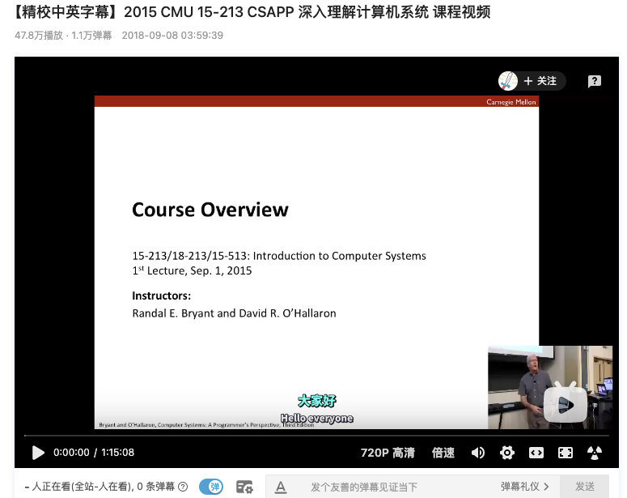

如果你是在校生，有了一定 C 语言基础后，非常建议你就开始看这本书，有精力也可以做做 CSAPP 的 lab。**越早开始看，你的收益就越大，因为当计算机体系搭建起来后，你后面再深入每一个课程的时候，你会发现学起来会比较轻松些。**

对于已经工作了，但是计算机系统没有一个清晰认识的读者，也可以从这本书开始一点一点学起来，这本书是很厚，但是并不一定要把书完完看完，每个章节的知识点还是比较独立的，有关硬件的章节我们可以选择跳过。

## 三、操作系统

操作系统真的可以说是 `Super Man`，它为了我们做了非常厉害的事情，以至于我们根本察觉不到，只有通过学习它，我们才能深刻体会到它的精妙之处，甚至会被计算机科学家设计思想所震撼，有些思想实际上也是可以应用于我们工作开发中。

操作系统比较重要的四大模块，分别是[内存管理](https://mp.weixin.qq.com/s?__biz=MzUxODAzNDg4NQ==&mid=2247485033&idx=1&sn=bf9ba7aca126ad186922c57a96928593&scene=21#wechat_redirect)、[进程管理 ](https://mp.weixin.qq.com/s?__biz=MzUxODAzNDg4NQ==&mid=2247485175&idx=1&sn=eda03758d4e810afd897ade44c19a508&scene=21#wechat_redirect)、[文件系统管理](https://mp.weixin.qq.com/s?__biz=MzUxODAzNDg4NQ==&mid=2247485446&idx=1&sn=2c525f008622b98bc08a66f2b4dcfee8&scene=21#wechat_redirect)、[输入输出设备管理](https://mp.weixin.qq.com/s?__biz=MzUxODAzNDg4NQ==&mid=2247485498&idx=1&sn=6948f309461ea83c691892949c8272dd&scene=21#wechat_redirect)。这是我学习操作系统的顺序，也是我推荐给大家的学习顺序，因为内存管理不仅是最重要、最难的模块，也是和其他模块关联性最大的模块，先把它搞定，后续的模块学起来我认为会相对轻松一些。

学习的过程中，你可能会遇到很多「虚拟」的概念，比如虚拟内存、虚拟文件系统，实际上它们的本质上都是一样的，都是**向下屏蔽差异，向上提供统一的东西**，以方便我们程序员使用。

还有，你也遇到各种各样的[调度算法](https://mp.weixin.qq.com/s?__biz=MzUxODAzNDg4NQ==&mid=2247485564&idx=1&sn=b1673a5da4fab943a8a0d27ca1f1fb5c&scene=21#wechat_redirect)，在这里你可以看到数据结构与算法的魅力，重要的是我们要理解为什么要提出那么多调度算法，你当然可以说是为了更快更有效率，但是因什么问题而因此引入新算法的这个过程，更是我们重点学习的地方。

你也会开始明白进程与线程最大的区别在于上下文切换过程中，**线程不用切换虚拟内存**，因为同一个进程内的线程都是共享虚拟内存空间的，线程就单这一点不用切换，就相比进程上下文切换的性能开销减少了很多。由于虚拟内存与物理内存的映射关系需要查询页表，页表的查询是很慢的过程，因此会把常用的地址映射关系缓存在 TLB 里的，这样便可以提高页表的查询速度，如果发生了进程切换，那 TLB 缓存的地址映射关系就会失效，缓存失效就意味着命中率降低，于是虚拟地址转为物理地址这一过程就会很慢。

你也开始不会傻傻的认为 read 或 write 之后数据就直接写到硬盘了，更不会觉得多次操作 read 或 write 方法性能会很低，因为你发现操作系统会有个「**磁盘高速缓冲区**」，它已经帮我们做了缓存的工作，它会预读数据、缓存最近访问的数据，以及使用 I/O 调度算法来合并和排队磁盘调度 I/O，这些都是为了减少操作系统对磁盘的访问频率。

……

还有太多太多了，我在这里就不赘述了，剩下的就交给你们在学习操作系统的途中去探索和发现了。

还有一点需要注意，学操作系统的时候，不要误以为它是在说 Linux 操作系统，这也是我初学的时候犯的一个错误，操作系统是集合大多数操作系统实现的思想，跟实际具体实现的 Linux 操作系统多少都会有点差别，如果要想 Linux 操作系统的具体实现方式，可以选择看 Linux 内核相关的资料，但是在这之前你先掌握了操作系统的基本知识，这样学起来才能事半功倍。

### 入门系列

对于没学过操作系统的小白，我建议学的时候，不要直接闷头看书。

相信我，你不用几分钟就会打退堂鼓，然后就把厚厚的书拿去垫显示器了，从此再无后续，毕竟直接看书太特喵的枯燥了，当然不如用来垫显示器玩游戏来着香。

B 站关于操作系统课程资源很多，我在里面也看了不同老师讲的课程，觉得比较好的入门级课程是《**操作系统 - 清华大学**》，该课程由清华大学老师向勇和陈渝授课，虽然我们上不了清华大学，但是至少我们可以在网上选择听清华大学的课嘛。课程授课的顺序，就如我前面推荐的学习顺序：「内存管理 -> 进程管理 -> 文件系统管理 -> 输入输出设备管理」。

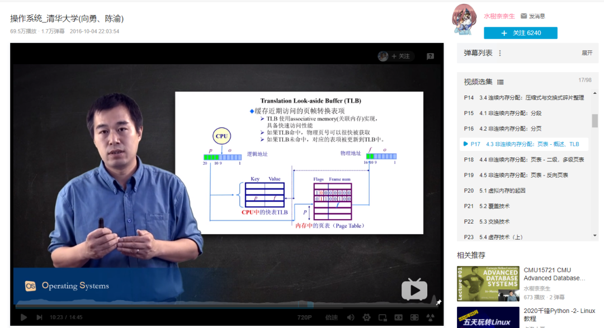

该清华大学的视频教学搭配的书应该是《**现代操作系统**》，你可以视频和书籍两者结合一起学，比如看完视频的内存管理，然后就看书上对应的章节，这样相比直接啃书相对会比较好。

清华大学的操作系统视频课讲的比较精炼，涉及到的内容没有那么细，《**操作系统 - 哈工大**》李治军老师授课的视频课程相对就会比较细节，老师会用 Linux 内核代码的角度带你进一步理解操作系统，也会用生活小例子帮助你理解。

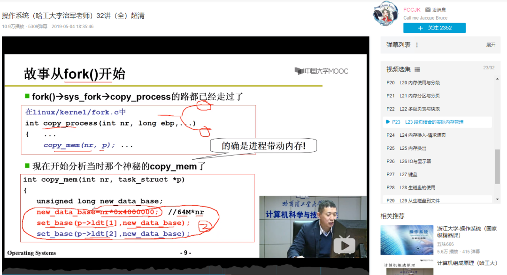

### 深入系列

《现代操作系统》这本书我感觉缺少比较多细节，说的还是比较笼统，而且书也好无聊。

推荐一个说的更细的操作系统书 —— 《**操作系统导论**》，这本书不仅告诉你 What，还会告诉你 How，书的内容都是循序渐进，层层递进的，阅读起来还是觉得挺有意思的，这本书的内存管理和并发这两个部分说的很棒。

去年国内也出了一本不错的操作系统书《**现代操作系统-原理与实现**》，这本书不怎么厚，把操作系统重要的知识都讲了一遍，是我看过的操作系统书里配图比较多的书了，学起来不会太费解。

当然，少不了这本被称为神书的《**深入理解计算机系统**》，豆瓣评分高达 `9.8` 分，这本书严格来说不算操作系统书，它是以程序员视角理解计算机系统，不只是涉及到操作系统，还涉及到了计算机组成、C 语言、汇编语言等知识，是一本综合性比较强的书。

## 四、计算机网络

计算机网络相比操作系统好学非常多，因为计算机网络不抽象，你要想知道网络中的细节，你都可以通过抓包来分析，而且不管是手机、个人电脑和服务器，它们所使用的计算网络协议是一致的。

也就是说，计算机网络不会因为设备的不同而不同，大家都遵循这一套「规则」来相互通信，这套规则就是 TCP/IP 网络模型。

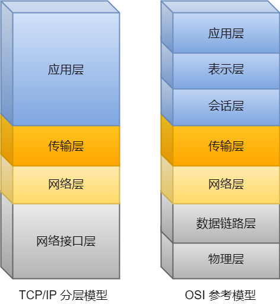

OSI 参考模型与 TCP/IP 的关系

TCP/IP 网络参考模型共有 `4` 层，其中需要我们熟练掌握的是应用层、传输层和网络层，至于网络接口层（数据链路层和物理层）我们只需要做简单的了解就可以了。

对于应用层，当然重点要熟悉最常见的 [HTTP 和 HTTPS ](https://mp.weixin.qq.com/s?__biz=MzUxODAzNDg4NQ==&mid=2247483971&idx=1&sn=8f2d5dae3d95efc446061b352c8e9961&scene=21#wechat_redirect)，传输层 TCP 和 UDP 都要熟悉，网络层要熟悉 [IPv4 ](https://mp.weixin.qq.com/s?__biz=MzUxODAzNDg4NQ==&mid=2247483971&idx=1&sn=8f2d5dae3d95efc446061b352c8e9961&scene=21#wechat_redirect)，IPv6 可以做简单点了解。

我觉得学习一个东西，就从我们常见的事情开始着手。

比如， ping 命令可以说在我们判断网络环境的时候，最常使用的了，你可以先把你电脑 ping 你舍友或同事的电脑的过程中发生的事情都搞明白，这样就基本知道一个数据包是怎么转发的了，于是你就知道了网络层、数据链路层和物理层之间是如何工作，如何相互配合的了。

搞明白了 ping 过程，就明白了两个计算机是怎么通信的了，然后你学起 HTTP 请求过程的时候，会很快就能掌握了，因为网络层以下的工作方式，你在学习 ping 的时候就已经明白了，这时就只需要认真掌握传输层中的 TCP 和应用层中的 HTTP 协议，就能搞明白[访问网页的整个过程](https://mp.weixin.qq.com/s?__biz=MzUxODAzNDg4NQ==&mid=2247483989&idx=1&sn=7e2ed852770743d3955ef9d5561fcef3&scene=21#wechat_redirect)了，这也是面试常见的题目了，毕竟它能考察你网络知识的全面性。

重中之重的知识就是 TCP 了，TCP 不管是[建立连接、断开连接 ](https://mp.weixin.qq.com/s?__biz=MzUxODAzNDg4NQ==&mid=2247484005&idx=1&sn=cb07ee1c891a7bdd0af3859543190202&scene=21#wechat_redirect)的过程，还是数据传输的过程，都不能放过，针对数据可靠传输的特性，又可以拆解为[超时重新、流量控制、滑动窗口、拥塞控制](https://mp.weixin.qq.com/s?__biz=MzUxODAzNDg4NQ==&mid=2247484017&idx=1&sn=dc54d43bfd5dc088e48adcfa2e2bc13f&scene=21#wechat_redirect)等等知识点，学完这些只能算对 TCP 有个「**感性**」的认识，另外我们还得知道 Linux 提供的 [TCP 内核的参数 ](https://mp.weixin.qq.com/s?__biz=MzUxODAzNDg4NQ==&mid=2247484774&idx=1&sn=fa9e67e60c5f9d2e9d2aa6ea8ab2a441&scene=21#wechat_redirect)的作用，这样才能从容地应对工作中遇到的问题。

接下来，推荐我看过并觉得不错的计算机网络相关的书籍和视频。

### 入门系列

此系列针对没有任何计算机基础的朋友，如果已经对计算机轻车熟路的大佬，也不要忽略，不妨看看我推荐的正确吗。

如果你要入门 HTTP，首先最好书籍就是《**图解 HTTP**》了，作者真的做到完完全全的「图解」，小林的图解功夫还是从这里偷学到不少，书籍不厚，相信优秀的你，几天就可以看完了。

如果要入门 TCP/IP 网络模型，我推荐的是《**图解 TCP/IP**》，这本书也是以大量的图文来介绍了 TCP/IP 网络模式的每一层，但是这个书籍的顺序不是从「应用层 —> 物理层」，而是从「物理层 -> 应用层」顺序开始讲的，这一点我觉得不太好，这样一上来就把最枯燥的部分讲了，很容易就被劝退了，所以我建议先跳过前面几个章节，先看网络层和传输层的章节，然后再回头看前面的这几个章节。

另外，你想了解网络是怎么传输，那我推荐《**网络是怎样连接的**》，这本书相对比较全面的把访问一个网页的发生的过程讲解了一遍，其中关于电信等运营商是怎么传输的，这部分你可以跳过，当然你感兴趣也可以看，只是我觉得没必要看。

如果你觉得书籍过于枯燥，你可以结合 B 站《**计算机网络微课堂**》视频一起学习，这个视频是湖南科技大学老师制作的，PPT 的动图是我见过做的最用心的了，一看就懂的佳作。

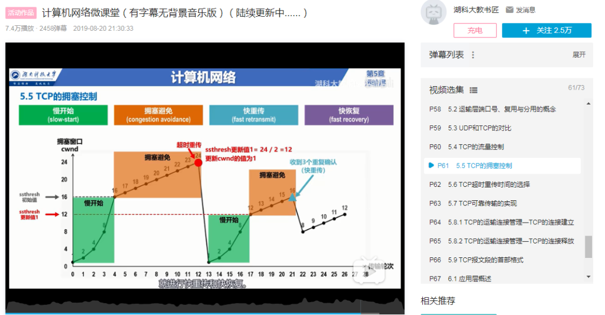

《计算机网络微课堂》

### [#](https://xiaolincoding.com/cs_learn/cs_learn.html#%E6%B7%B1%E5%85%A5%E5%AD%A6%E4%B9%A0-2)深入学习

看完入门系列，相信你对计算机网络已经有个大体的认识了，接下来我们也不能放慢脚步，快马加鞭，借此机会继续深入学习，因为隐藏在背后的细节还是很多的。

对于 TCP/IP 网络模型深入学习的话，推荐《**计算机网络 - 自顶向下方法**》，这本书是从我们最熟悉 HTTP 开始说起，一层一层的说到最后物理层的，有种挖地洞的感觉，这样的内容编排顺序相对是比较合理的。

但如果要深入 TCP，前面的这些书还远远不够，赋有计算机网络圣经的之说的《**TCP/IP 详解 卷一：协议**》这本书，是进一步深入学习的好资料，这本书的作者用各种实验的方式来细说各种协议，但不得不说，这本书真的很枯燥，当时我也啃的很难受，但是它质量是真的很高，这本书我只看了 TCP 部分，其他部分你可以选择性看，但是你一定要过几遍这本书的 TCP 部分，涵盖的内容非常全且细。

要说我看过最好的 TCP 资料，那必定是《**The TCP/IP GUIDE**》这本书了，目前只有英文版本的，而且有个专门的网址可以白嫖看这本书的内容，图片都是彩色，看起来很舒服很鲜明，小林之前写的 TCP 文章不少案例和图片都是参考这里的，这本书精华部分就是把 TCP 滑动窗口和流量控制说的超级明白，很可惜拥塞控制部分说的不多。

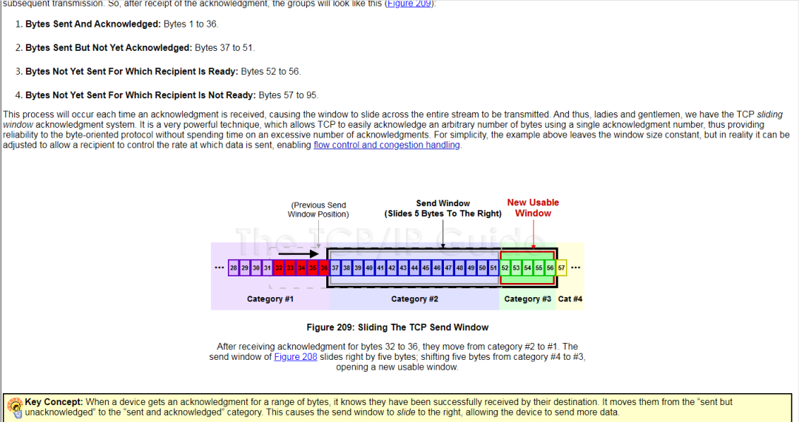

> 白嫖站点：http://www.tcpipguide.com/free/t_TCPSlidingWindowAcknowledgmentSystemForDataTranspo-6.htm

当然，计算机网络最牛逼的资料，那必定 **RFC 文档**，它可以称为计算机网络世界的「法规」，也是最新、最权威和最正确的地方了，困惑大家的 TCP 为什么三次握手和四次挥手，其实在 RFC 文档几句话就说明白了。

> TCP 协议的 RFC 文档：https://datatracker.ietf.org/doc/rfc1644/

### [#](https://xiaolincoding.com/cs_learn/cs_learn.html#%E5%AE%9E%E6%88%98%E7%B3%BB%E5%88%97)实战系列

在学习书籍资料的时候，不管是 TCP、UDP、ICMP、DNS、HTTP、HTTPS 等协议，最好都可以亲手尝试抓数据报，接着可以用 [Wireshark 工具 (opens new window)](https://mp.weixin.qq.com/s?__biz=MzUxODAzNDg4NQ==&mid=2247484469&idx=1&sn=55ec7f4addf10ddf25e8c8806da83921&scene=21#wechat_redirect)看每一个数据报文的信息，这样你会觉得计算机网络没有想象中那么抽象了，因为它们被你「抓」出来了，并毫无保留地显现在你面前了，于是你就可以肆无忌惮地「扒开」它们，看清它们每一个头信息。

那在这里，我也给你推荐 2 本关于 Wireshark 网络分析的书：**《Wireshark 网络分析就这么简单》 与 《Wireshark 网络分析的艺术》**。

这两本书都是同一个作者，书中的案例都是源于作者工作中的实际的案例，作者的文笔相当有趣，看起来堪比小说一样爽，相信你不用一个星期 2 本都能看完了。

## 五、MySQL

MySQL 入门的话是了解 SQL 语法，进阶的话是深入底层实现原理。

千万不要一上来就看《高性能 MySQL 》，我曾经先读《高性能 MySQL 》然后一路暴雷… 因为这本不是入门的书籍！

我先介绍下 MySQL 的重点知识，也是面试常面的知识点：

- **基本语法**：select/delete/insert/update、limit、join等
- **索引**：B+树，聚族索引，二级索引，组合索引，最左匹配原则，索引失效、慢查询
- **事务**：事务四大特性ACID，事务隔离级别，MVCC
- **锁**：全局锁、表级锁、行级锁、快照读、当前读、乐观锁、悲观锁、死锁
- **日志**：重做日志(redo log)、回滚日志(undo log)、二进制日志(binlog)
- **架构**：读写分离、主从架构、分库分表、数据库和缓存双写一致性

MySQL 入门推荐《**SQL必知必会**》，这一本很薄的书，主要是讲数据库增删查改的 SQL 语法。

学完 SQL 语法，我们不能止步，要深入去了解 MySQL 底层知识。

这里建议先看《**MySQL 是怎么运行的**》，这本书含有很多图，是小白学习 MySQL 底层知识的最佳书籍，看了下作者简介，他是裸辞一年在家里写出来的这本书，看的出来非常用心的了。

MySQL 用的最多的就是 InnoDB 引擎了，所以进一步学习 InnoDB 是很有必要的，这里推荐《**MySQL技术内幕**》，这本书可以结合《MySQL是怎么样运行的》一起看。

好了，看完上面的，你对 MySQL 已经有相当多的认识了，MySQL 还有一本高性能的书《高性能 MySQL 》，非常的经典，这本书比较厚，大家可以当作字典，索引章节大家可以去看看，看完后你对索引的认识又会刷新一遍。

## 六、Redis

要入门Redis，就要先知道这东西怎么用，说白了，最开始就是先学习操作Reids的相关命令，就像我们入门MySQL的时候，都是先学习SQL语言。

入门 Redis 命令这一块我当时没有去专门买书看，而是直接看视频，因为我觉得命令的使用实操性还是比较强的，跟着老师敲命令学习会比较快一些。

这里我推荐下**尚硅谷 Redis 视频课**，在 B 站就可以看，讲的还是挺清晰的，也把Redis很多重点知识也讲了，比如 Redis基本数据结构、持久化技术、主从复制、哨兵、集群等等，一套连招下来，就基本入门了。

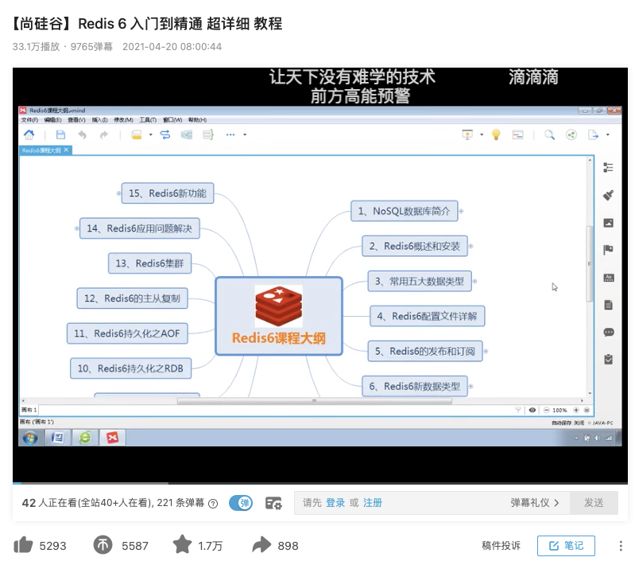

Redis 官网也有一整套的命令详解，遇到需要或者不会的地方可以查一下：http://doc.redisfans.com

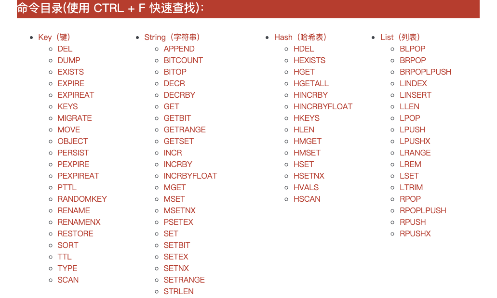

视频是帮助我们快速入门，但是并不能至于视频，因为一些细节的知识点视频上并没有提及，这时候我们就要回归书本。

这里推荐学习Redis的圣经级别的书——《**Redis设计与实现**》，因为它太经典了！

这本书不是教你如何使用 Redis，而是讲解跟你讲Redis是怎么实现，怎么设计的，也就说源码级别的学习，但是书上并没有大段贴代码，作者是用伪代码的方式来讲解，所以读起来不会太难的。

书本上主要围绕这几大知识点：**数据结构、AOF和RDB持久化技术、网络输入输出系统、主从复制、哨兵模式、集群模式。**

到这里你已经是入门Redis了，不仅会了 Redis 基本命令，还懂 Redis 的实现，剩下的就是学习如何在实战中运用Redis。

这里推荐《**Redis实战**》这本书，该书通过实际的例子， 展示了使用 Redis 构建多种不同的应用程序的方法。

处于进阶阶段的 Redis 学习者可以通过阅读该书来学习如何使用 Redis 去构建实际的应用，然后举一反三， 把书中介绍的程序和方法应用到自己遇到的问题上。

## 七、看书心得

**没有人规定看书一定要一页一页的全部看完，我们要知道看书的目的是什么？**

无非不就是收获知识，和解决问题嘛。

所以最好的看书方式是带着问题去翻阅，比如：

- 带着程序是如何在计算机里跑起来的问题，去学计算机组成原理；
- 带着输入一条 url 到网页显示， 期间发生了什么的问题，去学习计算机网络；
- 带着进程、内存、磁盘是如何被操作系统管理点，去学习操作系统；
- 带着如何实现一个高并发网络模型，去学习网络编程；
- …

我之前也写过一篇我的看书心得，帮助到了很多同学，建议没看过的同学，去看看； [看书的一点小建议](https://mp.weixin.qq.com/s?__biz=MzUxODAzNDg4NQ==&mid=2247493177&idx=1&sn=77e32cec53e8a1aee9fa9fd3b31b19c2&scene=21#wechat_redirect)

## 八、融汇贯通

看到这，很多小伙伴会说了，学了这么多计算机基础，怎么将这些知识点融会贯通呢？

我之前写过一篇文章，用一个案例把计算机原理 + 操作系统 + 数据结构 + 计算机网络融会贯通，带大家感受下感受计算基础之美：[如何将计算机组成、操作系统、计算机网络、数据结构与算法融会贯通？](https://mp.weixin.qq.com/s?__biz=MzUxODAzNDg4NQ==&mid=2247495586&idx=1&sn=14450e0efaef7a9eeeccb15faa2d007c&scene=21#wechat_redirect)


# 补充

# 看书的一点小建议

大家好，我是小林。

昨天看到小北写了篇「[看书的一点小建议 (opens new window)](https://mp.weixin.qq.com/s?__biz=Mzg4NjUxMzg5MA==&mid=2247490764&idx=1&sn=7f1b25efd659ee6ca66b4845fbdba9cb&scene=21#wechat_redirect)」，写的很不错，今天我也根据自己经历，分享下看计算机基础类书的心得。

每隔一段时间，都有些读者跑来请教我学习的心得。

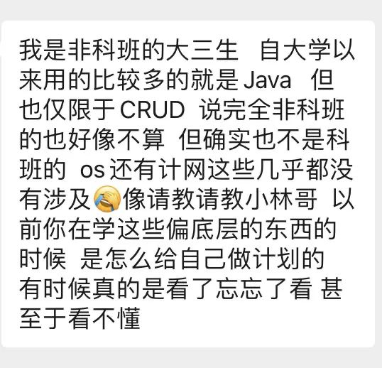


他们的困惑可以归类这几点：

- 书看不懂，容易放弃，怎么办？
- 看书的效率很低，怎么办？
- 做了很多笔记，依然过会就忘记，怎么办？

这些困惑我曾经也经历过，中途也踩过很多坑，浪费了很多的时间，好在及时反思，调整了看书的方法，后面学习的效率立竿见影。

------

## 不要直接选择困难模式

大家应该知道计算机书里有个黑皮系列的书，黑皮系列的书有一个共同的特点就是**厚重**！

我相信不少小伙伴在想要学习计算机基础类知识的时候，就买了这类黑皮书，书到货后，我们满怀信心，举着厚重的黑皮书，下决心要把这些黑皮书一页一页地攻读下来，结果不过几天就被劝退了，然后就只有前几页是有翻阅的痕迹，剩下的几百页都完全是新的，最终这些厚厚的黑皮书就成了**垫显示器的神器**。


黑皮系列的书确实都是经典书，豆瓣评分都很高，知识点很全面，是好书无疑。但是这类书并不适合新手入门，你想想我们学习中文的时候，你是拿着新华字典学的吗？很显然不是。

黑皮书就好像游戏里「困难模式」，新人一上来就玩这个模式，根本就体会不到游戏的乐趣了，卸载了游戏那还是小事，如果留下心里阴影，造成不可逆的伤害，这就非常不好了。

说白了，这些厚的不行的计算机书不适合入门，我们应该先从「简单模式」慢慢过渡，**要屠龙，得先从新手村起步**。

就拿我亲身经历举例。

当初在学习计算机网络的时候，看见大家都说《计算机网络-自顶向下》和《TCP/IP 详解》这两本书好，我立马买了学习，这本也是黑皮系列大厚书，奈何小林当时太菜，根本就砍不动这本书，砍两下，刀钝了，就想睡觉。

后面又找了一波书，发现《图解 TCP/IP》、 《图解 HTTP》、《网络是怎么连接的》这几本书都不厚，而且搭配了很多图，我又立马买回来学习。

这几本书读起来不会太困难，不出一个月，我就把这三本书看完了，立马对计算机网络有了个整体且清晰的认识，终于知道了网络七层模型是什么，也知道了两台电脑是如何通过网络进行相互通信的，也知道 HTTP、DNS、TCP、UDP、IP、ICMP、DHCP、ARP 这些常见的协议是用来干嘛的了，成功突破了新手村。

虽然突破了新手村，但是学的知识还不够深入。

所以，我后面回来看《计算机网络-自顶向下》和《TCP/IP 详解》这两本厚厚的书，不过这次就不会那么吃力了。

后面回看这两本书时，我也没有选择从头看到尾，因为有些内容和在新手村看的书的内容重叠了，而且由于在新手村里知道了哪几个协议是常见的，于是就选择了这几个协议的章节进行深入学习，比如：

- 我想进一步学习 TCP 协议的特性，于是就跳到《TCP/IP 详解》书里讲 TCP 协议的几个章节，我就从中学到了 TCP 流量控制、超时重传、拥塞控制等等。
- 我想进一步学习 IP 协议，于是就跳到《计算机网络-自顶向下》书里讲 IP 协议的章节，我就从中学到了 IP 协议更多的细节，IP 包头的各个字段用途、寻址、路由转发的原理等等。

看了黑皮书，我也深刻感受到黑皮系列的书确实经典，知识体系很全面，也很细节。

但是这种大且全的书并不意味着适合入门，新手很容易就在各种细节中迷失，而且书上有些不常用的协议我们是可以选择不看的，如果不知道重点很容易就把时间浪费在这些地方，得不偿失。

我是在新手村学习里抓到学习计算机网络的方向，也就是把「**键入网址，到网页显示，期间发生了什么？**」这个问题所涉及到的协议都要掌握，比如 HTTP、DNS、TCP、UDP、IP、ARP、MAC 等等，然后再查黑皮书对应的章节来深入学习对应的协议。

不仅仅是计算机网络，我在学习操作系统、计算机组成原理、网络编程等等也是用这套方法，都是先看新手村的书，得知了哪些是重点知识后，再跳到黑皮书里对应该知识的章节进行深入学习。

当初在学网络编程的时候，看见网上的人都说 UNP（Unix 网络编程）、APUE（Unix 高级环境编程）这两本书是网络编程圣经的书，那么好学的小林，那肯定毫无犹豫买了。

书到货后，我瞬间就懵逼了，这两本书是我买过最厚的书，这尼玛怎么学？

跟着书本的节奏，学了一段的时间，是懂了些 Linux 网络和系统 API 的用法，摸索来摸索去都是各个 API 的细节，**始终不知道高并发网络框架是如何实现的**。

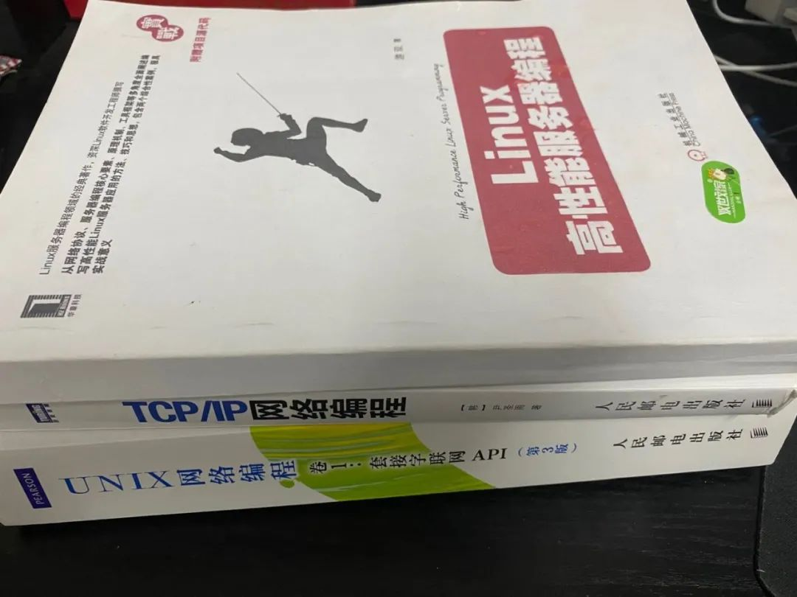

后面我又重新找了一波关于网络编程的书，找到了这两本：《TCP/IP 网络编程》和《Linux高性能服务器编程》。

- 《TCP/IP 网络编程》绝对是新手村级别的书，书里的内容不会有过多的术语，作者都用大白话来表达，配图也很清晰，也有介绍我想知道的网络框架，虽然是比较基础的多进程服务端模型、多线程服务端模型、异步 IO 模型。而且最后一章实现了简单的 HTTP 服务端，让我知道了从代码角度是怎么解析 HTTP 报文的，以及状态机是如何实现和运转的。
- 《Linux高性能服务器编程》这本书主要是网络框架为主，前几章关于网络基础知识对于掌握了计算机网络知识的同学可以直接跳过的，你看，很多知识是想通的，当我们知道掌握了这块知识后，在学习新一本书的时候，就可以跳过重叠的内容。在这本书我学到了，Reactor、Proactor、信号、定时器、多进程编程、多线程编程、进程池和线程池等。

这两本书让我大概知道了如果一个服务端要服务多个客户端时，不是就简单写个 socket 编程就完事，而是还要结合 IO 多路复用 + 多线程的思想，也就是 Reactor 的设计理念，知道了这些事情后，后面我在看很多开源框架的网络模型时候，发现大多数基于 Reactor 的思想来实现的。

有了网络编程总体的视角后，在需要深入理解 socket api 中各种属性设置（超时、非阻塞 IO、阻塞 IO 等）和异常处理就要回归 APUE 这本书。

到这里我才知道 UNP 和 APUE 为什么会被称为网络编程圣经级别的书，原因是书里各种细节和异常都写的很全，也很细致，可以应对工作中很多问题。

但是事实证明，它并不是个入门级的书，所以 UNP 和 APUE 的用途比较像字典，在需要的时候去查阅就好。

学习算机组成也一样，我先看《程序是怎么样跑起来的》这本书，知道了程序跑起来的大概过程以及涉及到的知识点，然后带着这个问题，从《计算机组成与设计》这本黑皮书找到每一部分的细节，通过进一步学习，知道了程序编译过程，知道了 Intel x86 的指令结构，知道了计算机是如何存储并计算浮点数的，知道了 CPU 执行程序的工作流程，知道了计算机存储结构金字塔模型等等。

所以，大家在学习的时候，应该避免直接学大而全的书，我们要先从入门级别的书看起，抓住了主线重点知识后，再通过查阅这类大而全的书来进行深入学习。

------

## 不要只局限学一本书

我在学习的时候，有个习惯，喜欢找同类型的书一起学，就不会说学操作系统的时候，就只看一本理论书，而是结合 Linux 系统编程和内核分析的书一起看，**一层层的深入一个知识点**。

比如，我在学习操作系统的时候，在《现代操作系统》学了「进程与线程」的内容，而这本书介绍的内容比较概念性的，知识点也比较笼统，不够具体。

然后我就会去学《Unix 高级环境编程》第 7 章「进程环境」、第 8 章「进程控制」、第 11 章「线程」、第 12 章「线程控制」、第 15 章「进程间通信」，这一系列章节看完后，就知道了 Linux 是如果通过创建进程和线程，不只局限于理论了，还学会了应用。

当然这还不够，我还会去学《深入 Linux 内核架构》第 2 章关于进程和线程的Linux 源码分析，发现 Linux 中进程和线程实际上都是用一个结构体 `task_struct` 来表示的。让我很惊叹的是， Linux 操作系统对于进程和线程的创建，都是调用 `do_fork` 函数实现的。

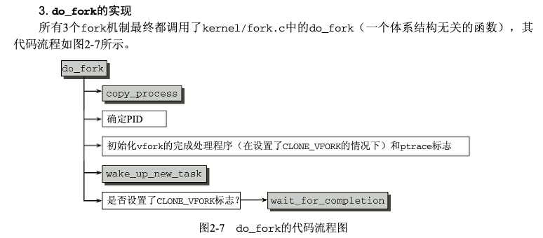

只不过传递的参数不同，通过参数的不同来控制是复制父进程的资源（内存、文件描述、信号量等），还是引用父进程的资源，这样会更加深刻知道进程和线程的区别。

再比如，我在学习计算机网络的时候，在《图解 TCP/IP》学到了第六章关于 TCP 超时重传、流量控制、拥塞控制等内容，这本书讲的比较浅。

为了更深入理解 TCP，我就会去看《TCP/IP 详解》第 17 到 24 章，这几章都是详细介绍了 TCP，在这里会学到更全面的 TCP，比如 同时打开或关闭、negle 算法、往返时间 RTT 的计算、还有拥塞控制、快速重传、快速恢复、慢启动这些过程中的拥塞窗口是怎么变化的等等。

但是我在学《TCP/IP 详解》遇到了点困难，因为书里的案例有些地方看的不清晰，也不容易懂，特别是那些 TCP 抓包图，看到瞎眼。

后面我找到了本神书：《TCP/IP Guide》，很可惜只有英文的，我只看了这本书讲滑动窗口和流量控制的章节，因为这本书的精华就是这两个，其他的一般般，这两个章节的配图特别多，也很清晰。

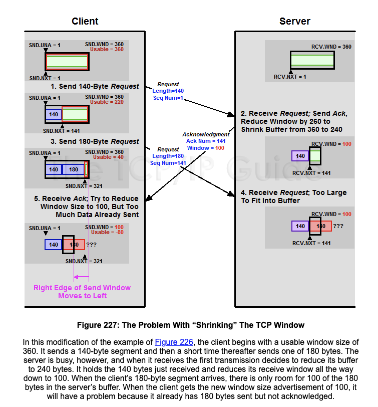

我就在这知道了发送窗口和接收窗口的工作过程，也知道了滑动窗口对流量的影响，也知道了操作系统内存紧张的时候，也会影响滑动窗口，以及糊涂窗口综合症等等。

所以在学习一个知识的时候，大家不一定要把一本书从头看到尾后，才去学另外一本书。

最好的方式是在一本书看完某个章节的知识点后，马上去学另外一本相对比较深入的书的对应章节的内容，这样一层一层的深入下去，你对这个知识点的掌握就会很深刻了。

------

## 不要只看不动手

计算机类的知识都比较庞大，单纯只看很容易就忘记的了，当然即使做了笔记也会忘记。

就像小林写了很多文章，每篇文章的内容我也不一定都记得住，但是当我回看文章后，知识点很快会被唤醒起来。

所以记笔记的好处在于后面复习的时候，可以很快就能回想起来。

记笔记的方式有很多种，手写在笔记本、在书上标注、在 world 文档记录等等，但这些我觉得都不是好的方式。

我觉得比较好的方式是**思维导图**，把思维导图当作一课自己的知识树，每深入学一个知识点的时候，就开一个分支去记录，记录的内容最好是用自己的话来描述，而不是复制书上的内容，这样只是单纯的 copy，最好经过自己大脑的思考，用自己的话做个小总结，这样的知识点不容易忘。

还有很多知识其实可以结合**生活中的场景**来记忆，这样想忘记都难，比如阻塞 IO、非阻塞 IO、同步 IO 和异步 IO，我之前文章用去饭堂打菜的场景来介绍它们之间的区别。

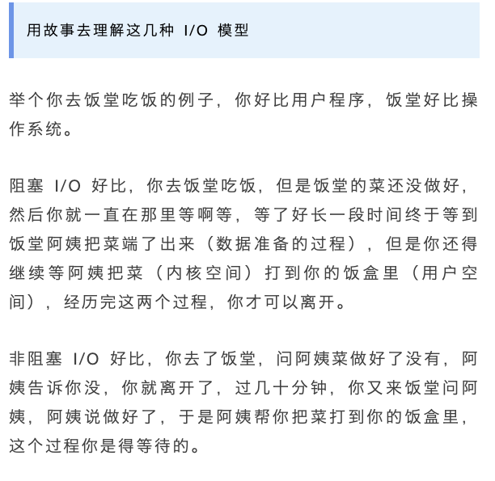

再比如介绍各种进程调度算法，我之前文章用银行业务办理的场景来介绍。

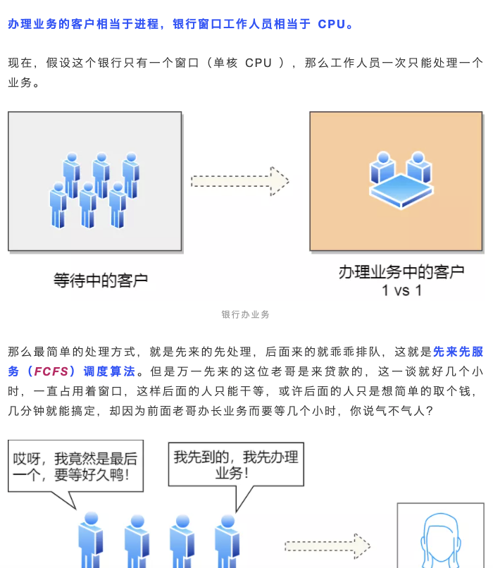

------

## 总结

最后做个总结，回答开头的问题。

> 书看不懂，容易放弃，怎么办？

不要一开始选择困难模式，也就是不要一开始选择大而全的书，这类书一般不适合入门学习。

我们先要找新手村级别的书来入门，新手村的书一般很快就看完的，看完后我们大概就知道这类书籍的重点知识，然后再通过查阅这些大而全的书的目录来学习对应章节的内容。

> 看书的效率很低，怎么办？

其实书并不一定要全部从头看完的，而且也不要固执到一直只看一本书。

最好在学习某个知识点的时候，通过看多本书来一层层的学习这个知识点，这样你学起来的知识点会比较全面，也更加深入。

按这种方式学，你会发现很多书都被你不经意间看了 7788 的。

> 做了很多笔记，依然过会就忘记，怎么办？

做笔记建议使用思维导图，把思维导图当作一课自己的知识树，每深入学一个知识点的时候，就开一个分支去记录。

在记录笔记的时候，尽量少 copy 书上的内容，最好还是经过自己思考后用自己的话输出的笔记，而且可以搭配生活场景来加深记忆点。

# 如何将计算机网络、操作系统、数据结构与算法、计算组成融会贯通？

有位关注我一年的读者找我，他去年关注我公众后，开始自学 CS，主要是计算机基础这一块。

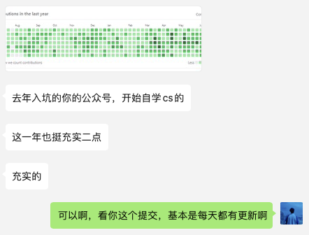

他从那时起，就日复一日的学习，并在 Github 有做笔记的习惯，你看他的提交记录，每天都有，一天都没拉下，就这样坚持了一年。

这个一年没有间断过的坚持，我是真的被震撼到，虽然我也经常肝文章，但是我也做不到每天都是学习的状态，总会想偷懒几天，毕竟学习真的是反人性的哈哈。

这位读者去年的时候，也只是会用 python 输出 hello world 初学者，而如今能开始啃 Redis 源码了，并且还记录了学习 Redis 数据结构的源码笔记。

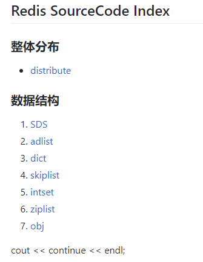

我也跟他讨论了我学计算基础的感受，他也有相同的感受，看来是同道中人。


之前有很多读者问我学计算机基础有啥用？不懂算法、计算机网络、操作系统这些东西，也可以完成工作上的 CRUD 业务开发，那为什么要花时间去学？

是的，不懂这些，确实不会影响 CRUD 业务开发，对于这类业务开发的工作，难点是在于对业务的理解，但是门槛并不高，找个刚毕业人，让他花几个月时间熟悉业务和代码，他一样可以上手开发了，也就是说，单纯的 CRUD 业开发工作很快就会被体力更好的新人取代的。

另外，在面对一些性能问题，如果没有计算机基础，我们是无从下手的，这时候程序员之间的分水岭就出来了。

**今天，我不讲虚的东西。**

**我以如何设计一个「\*高性能的单机管理主机的心跳服务\*」的方式，让大家感受计算基础之美，这里会涉及到数据结构与算法 + 操作系统 + 计算机组成 + 计算机网络这些知识。**

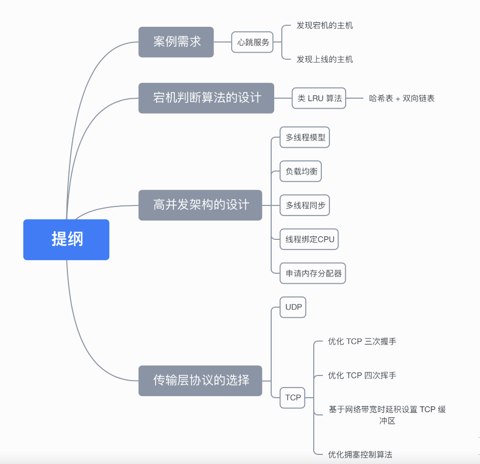

大家耐心看下去，你会发现原来计算机基础知识的用处，相信我，你会感触很深刻。

------

## 案例需求

后台通常是由多台服务器对外提供服务的，也就是所谓的集群。

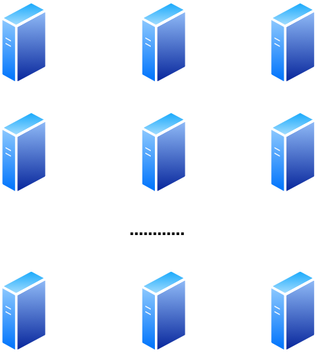

如果集群中的某一台主机宕机了，我们必须要感知到这台主机宕机了，这样才做容灾处理，比如该宕机的主机的业务迁移到另外一台主机等等。

那如何感知呢？那就需要**心跳服务**了。

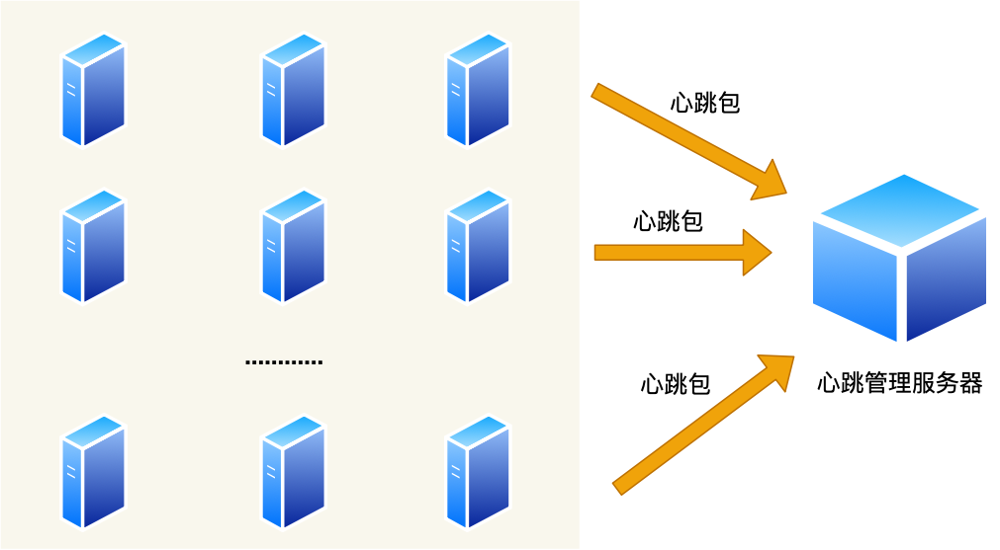

要求每台主机都要向一台主机上报心跳包，这样我们就能在这台主机上看到每台主机的在线情况了。

心跳服务主要做两件事情：

- **发现宕机的主机**；
- **发现上线的主机**。

看上去感觉很简单，但是**当集群达到十万，甚至百万台的时候，要实现一个可以能管理这样规模的集群的心跳服务进程，没点底层知识是无法做到的。**

接下来，将从三个维度来设计这个心跳服务：

- 宕机判断算法的设计
- 高并发架构的设计
- 传输层协议的选择

## 宕机判断算法的设计

这个心跳服务最关键是判断宕机的算法。

如果采用暴力遍历所有主机的方式来找到超时的主机，在面对只有几百台主机的场景是没问题，但是这个算法会随着主机越多，算法复杂度也会上升，程序的性能也就会急剧下降。

所以，我们应该设计一个可以应对超大集群规模的宕机判断算法。

我们先来思考下，心跳包应该有什么数据结构来管理？

心跳包里的内容是有主机上报的时间信息的，也就是有时间关系的，那么可以**用「双向链表」构成先入先出的队列**，这样就保存了心跳包的时序关系。


**由于采用的数据结构是双向链表，所以队尾插入和队头删除操作的时间复杂度是 O(1)。**

如果有新的心跳包，则将其插入到双向链表的尾部，那么最老的心跳包就是在双向链表的头部，这样在寻找宕机的主机时，只要看双向链表头部最老的心跳包，距现在是否超过 5 秒，如果超过 5秒 则认为该主机宕机，然后将其从双向链表中删除。

细心的同学肯定发现了个问题，就是如果一个主机的心跳包已经在队列中，那么下次该主机的心跳包要怎么处理呢？

为了维持队列里的心跳包是主机最新上报的，所以要先找到该主机旧的心跳包，然后将其删除，再把新的心跳包插入到双向链表的队尾。

问题来了，在队列找到该主机旧的心跳包，**由于数据结构是双向链表，所以这个查询过程的时间复杂度时 O(N)**，也就是说随着队列里的元素越多，会越影响程序的性能，这一点我们必须优化。

**查询效率最好的数据结构就是「哈希表」了，时间复杂度只有 O(1)**，因此我们可以加入这个数据结构来优化。

哈希表的 Key 是主机的 IP 地址，Value 包含**主机在双向链表里的节点**，这样我们就可以通过哈希表轻松找到该主机在双向链表中的位置。

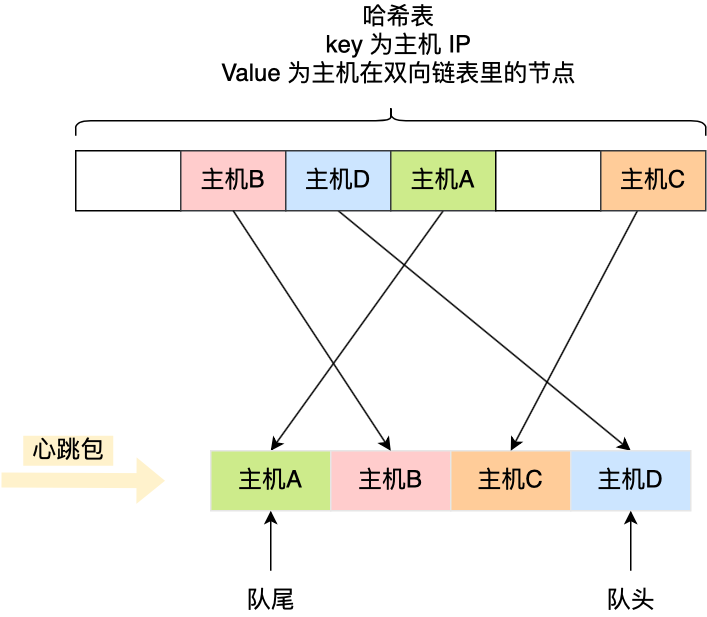

这样，每当收到心跳包时，先判断其在不在哈希表里。

- 如果不存在哈希表里，说明是新主机上线，**先将其插入到双向链表的尾部，然后将该主机的 IP 作为 Key，主机在双向链表的节点作为 Value 插入到哈希表**。
- 如果存在哈希表里，说明主机已经上线过，**先通过查询哈希表，找到该主机在双向链表里旧的心跳包的节点，然后就可以通过该节点将其从双向链表中删除，最后将新的心跳包插入到双向链表的队尾，同时更新哈希表**。

可以看到，上面这些操作全都是 O(1)，不管集群规模多大，时间复杂度都不会增加，但是代价就是内存占用会越多，这个就是以**空间换时间**的方式。

有个细节的问题，不知道大家发现了没有，就是为什么队列的数据结构采用双向链表，而不是单向链表？

因为双向链表比单向链表多了个 pre 的指针，可以通过其找到上一个节点，那么在删除中间节点的时候，就可以直接删除，而**如果是单向链表在删除中间的时候，我们得先通过遍历找到需被删除节点的上一个节点，才能完成删除操作，这里中间多了个遍历操作**。

既然引入哈希表，那我们在判断出有主机宕机了（检查双向链表队头的主机是否超时），**除了要将其从双向链表中删除，也要从哈希表中删除**。要将主机从哈希表删除，首先我们要知道主机的 IP，因为这是哈希表的 Key。

双向链表存储的内容必须包含主机的 IP 信息，那**为了更快查询到主机的 IP，双向链表存储的内容可以是一个键值对（Key-Value），其 Key 就是主机的 IP，Value 就是主机的信息。**

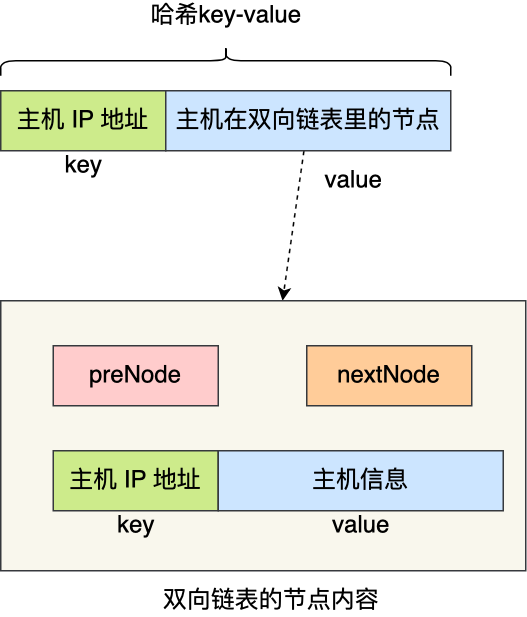

这样，在发现双向链表中头部的节点超时了，由于节点的内容是键值对，于是就能快速地从该节点获取主机的 IP ，知道了主机的 IP 信息，就能把哈希表中该主机信息删除。

至此，就设计出了一个高性能的宕机判断算法，主要用了数据结构：哈希表 + 双向链表，通过这个组合，查询 + 删除 + 插入操作的时间复杂度都是 O(1)，以空间换时间的思想，这就是**数据结构与算法之美**！

熟悉算法的同学应该感受出来了，上面这个算法就是**类 LRU 算法**，用于**淘汰最近最久使用的元素**的场景，该算法应用范围很广的，操作系统、Redis、MySQL 都有使用该算法。

在很多大厂面试的时候，经常会考察 LRU 算法，甚至会要求手写出来，后面我在写一篇 LRU 算法实现的文章。

## 高并发架构的设计

设计完高效的宕机判断算法后，我们来设计个能充分利用服务器资源的架构，以应对高并发的场景。

首先第一个问题，选用单线程还是多线程模式？

选用单线程的话，意味着程序只能利用一个 CPU 的算力，如果 CPU 是一颗 1GHZ 主频的 CPU，意味着一秒钟只有 10 亿个时钟周期可以工作，如果要让心跳服务程序每秒接收到 100 万心跳包，那么就要求它必须在 1000 个时时钟周期内处理完一个心跳包。

这是无法做到的，因为一个汇编指令的执行需要多个时钟周期，更何况高级语言的一条语句是由多个汇编指令构成的，而且这个 1000 个时钟周期还要包含内核从网卡上读取报文，以及协议栈的报文分析。

因此，采用单线程模式会出现算力不足的情况，意味着在百万级的心跳场景下，容易出现内核缓冲区的数据无法被及时取出而导致溢出的现象，然后就会出现大量的丢包。

所以，我们要选择多进程或者多线程的模式，来充分利用多核的 CPU 资源。多进程的优势是进程间互不干扰，但是内存不共享，进程间通信比较麻烦，**因此采用多线程模式开发会更好一些，多线程间可以共享数据。**

多线程体现在「分发线程是多线程和工作线程是多线程」，决定了多线程开发模式后，我们还需要解决五个问题。

#### 第一个多路复用

我们应该使用多路复用技术来服务多个客户端，而且是要**使用 epoll**。

因为 select 和 poll 的缺陷在于，当客户端越多，也就是 Socket 集合越大，Socket 集合的遍历和拷贝会带来很大的开销；

而 epoll 的方式即使监听的 Socket 数量越多的时候，效率不会大幅度降低，能够同时监听的 Socket 的数目也非常的多了。

多路复用更详细的介绍，可以看之前这篇文章：[这次答应我，一举拿下 I/O 多路复用！(opens new window)](https://mp.weixin.qq.com/s?__biz=MzUxODAzNDg4NQ==&mid=2247489558&idx=1&sn=7a96604032d28b8843ca89cb8c129154&scene=21#wechat_redirect)

#### 第二个负载均衡

在收到心跳包后，我们应该要将心跳包均匀分发到不同的工作线程上处理。

分发的规则可以用哈希函数，这样在接收到心跳包后，解析出主机的 IP 地址，然后通过哈希函数分发给工作线程处理。

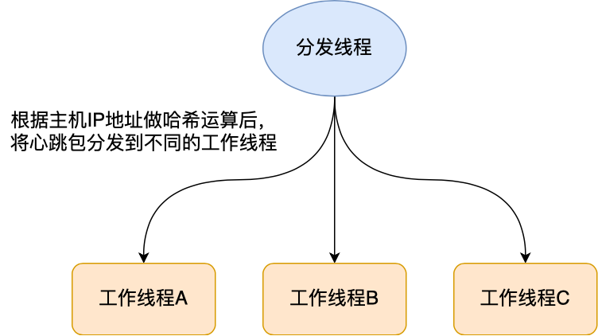

于是**每个工作线程只会处理特定主机的心跳包，多个工作线程间互不干扰，不用在多个工作线程间加锁，从而实现了无锁编程**。

#### 第三个多线程同步

分发线程和工作线程之间可以加个消息队列，形成「生产者 - 消费者」模型。

分发线程负责将接收到的心跳包加入到队列里，工作线程负责从队列取出心跳包做进一步的处理。

除此之外，还需要做如下两点。

第一点，工作线程一般是多于分发线程，**给每一个工作线程都创建独立的缓冲队列**。

第二点，缓冲队列是会被分发线程和工作线程同时操作，所以在操作该队列要加锁，为了避免线程获取锁失而主动放弃 CPU，可以**选择自旋锁，因为自旋锁在获取锁失败后，CPU 还在执行该线程，只不过 CPU 在空转，效率比互斥锁高**。

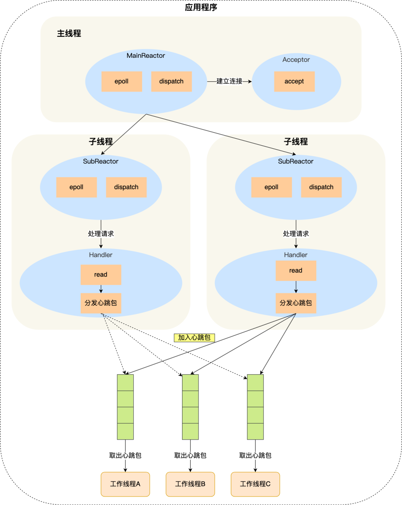

更多关于锁的讲解可以看这篇：「[互斥锁、自旋锁、读写锁、悲观锁、乐观锁的应用场景 (opens new window)](https://mp.weixin.qq.com/s?__biz=MzUxODAzNDg4NQ==&mid=2247485583&idx=1&sn=412546e55f9f5cf394bdda633fcc2b1c&scene=21#wechat_redirect)」

#### 第四个线程绑定 CPU

现代 CPU 都是多核心的，线程可能在不同 CPU 核心来回切换执行，这对 CPU Cache 不是有利的，虽然 L3 Cache 是多核心之间共享的，但是 L1 和 L2 Cache 都是每个核心独有的。

**如果一个线程在不同核心来回切换，各个核心的缓存命中率就会受到影响**，相反如果线程都在同一个核心上执行，那么其数据的 L1 和 L2 Cache 的缓存命中率可以得到有效提高，缓存命中率高就意味着 CPU 可以减少访问 内存的频率。

当有多个同时执行「计算密集型」的线程，为了防止因为切换到不同的核心，而导致缓存命中率下降的问题，我们可以把**线程绑定在某一个 CPU 核心上**，这样性能可以得到非常可观的提升。

在 Linux 上提供了 `sched_setaffinity` 方法，来实现将线程绑定到某个 CPU 核心这一功能。

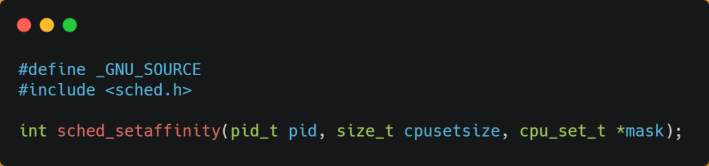

更多关于 CPU Cache 的介绍，可以看这篇：「[如何写出让 CPU 跑得更快的代码？ (opens new window)](https://mp.weixin.qq.com/s?__biz=MzUxODAzNDg4NQ==&mid=2247486022&idx=1&sn=8bb5a066d81f77523a06cd09251055da&scene=21#wechat_redirect)」

#### 第五个内存分配器

Linux 默认的内存分配器是 PtMalloc2，它有一个缺点在申请小内存和多线程的情况下，申请内存的效率并不高。

后来，Google 开发的 TCMalloc 内存分配器就解决这个问题，**它在多线程下分配小内存的速度要快很多**，所以对于心跳服务应当改用 TCMalloc 申请内存。

下图是 TCMalloc 作者给出的性能测试数据，可以看到线程数越多，二者的速度差距越大，**显然 TCMalloc 更具有优势。**

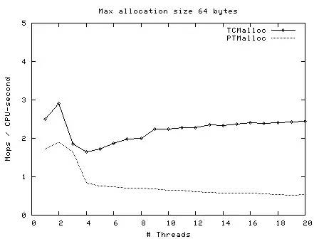

我暂时就想到这么多了，**这里每一个点都跟「计算机组成和操作系统」知识密切相关**。

## 传输层协议的选择

心跳包的传输层协议应该是选 TCP 和 UDP 呢？

对于传输层协议的选择，我们要看**心跳包的长度大小**。

如果长度小于 MTU，那么可以选择 UDP 协议，因为 UDP 协议没那么复杂，而且心跳包也不是一定要完全可靠传输，如果中途发生丢包，下一次心跳包能收到就行。

如果长度大于 MTU，就要选择 TCP 了，因为 UDP 在传送大于 1500 字节的报文，IP 协议就会把报文拆包后再发到网络中，并在接收方组装回原来的报文，然而，IP 协议并不擅长做这件事，拆包组包的效率很低。

所以，**TCP 协议就选择自己做拆包组包的事情，当心跳包的长度大于 MSS 时就会在 TCP 层拆包，且保证 TCP 层拆包的报文长度不会 MTU**。

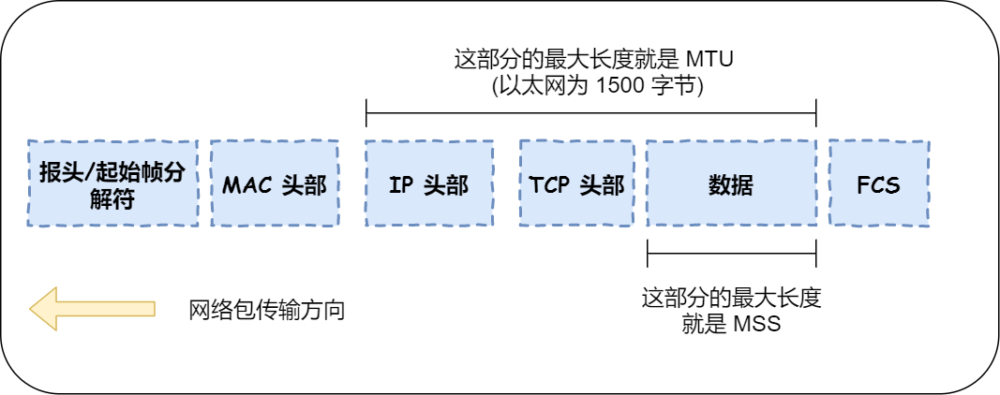MTU 与 MSS

选择了 TCP 协议后，我们还要解决一些事情，因为 TCP 协议是复杂的。

首先，要让服务器能支持更多的 TCP 连接，TCP 连接是通过**四元组**唯一确认的，也就是**「 源 IP、目的 IP、源端口、目的端口 」**。

那么当服务器 IP 地址（目的 IP）和监听端口（目标端口）固定时，变化的只有源 IP（2^32） 和源端口（2^16），因此理论上服务器最大能连接 `2^(32+16)` 个客户端。

这只是理论值，实际上服务器的资源肯定达不到那么多连接。Linux 系统一切皆文件，所以 TCP 连接也是文件，那么服务器要增大下面这两个地方的最大文件句柄数：

- 通过 `ulimit` 命令增大单进程允许最大文件句柄数；
- 通过 `/proc/sys/fs/file-nr` 增大系统允许最大文件句柄数。

另外， TCP 协议的默认内核参数并不适应高并发的场景，所以我们还得在下面这四个方向通过调整内核参数来优化 TCP 协议：

- 三次握手过程需要优化；
- 四次挥手过程需要优化：
- TCP 缓冲区要根据网络带宽时延积设置；
- 需要优化；

前三个的优化的思路，我在之前的文章写过，详见：「[面试官：换人！他连 TCP 这几个参数都不懂 (opens new window)](https://mp.weixin.qq.com/s?__biz=MzUxODAzNDg4NQ==&mid=2247484774&idx=1&sn=fa9e67e60c5f9d2e9d2aa6ea8ab2a441&scene=21#wechat_redirect)」

这里简单说一下优化拥塞控制算法的思路。

传统的拥塞控制分为四个部分：慢启动、拥塞避免、快速重传、快速恢复，如下图：

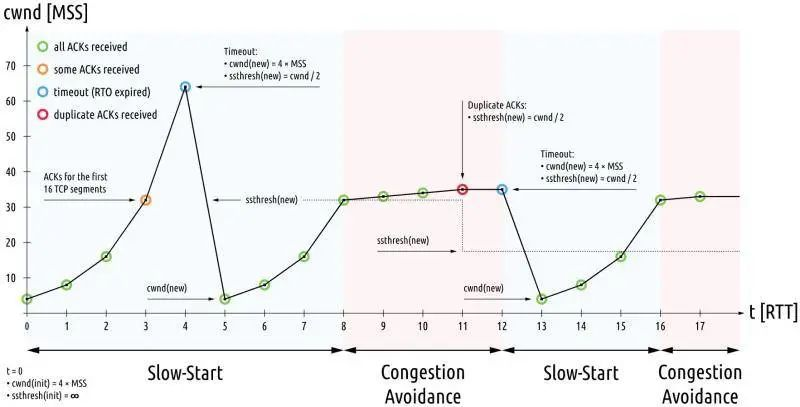TCP 拥塞控制

当 TCP 连接建立成功后，拥塞控制算法就会发生作用，首先进入慢启动阶段。决定连接此时网速的是初始拥塞窗口，默认值是 `10 MSS`。

在带宽时延积较大的网络中，应当调高初始拥塞窗口，比如 `20 MSS` 或 `30 MSS`，Linux 上可以通过 `route ip change` 命令修改它。

**传统的拥塞控制算法是基于丢包作为判断拥塞的依据**。不过实际上，网络刚出现拥塞时并不会丢包，而真的出现丢包时，拥塞已经非常严重了，比如像理由器里都有缓冲队列应对突发流量：

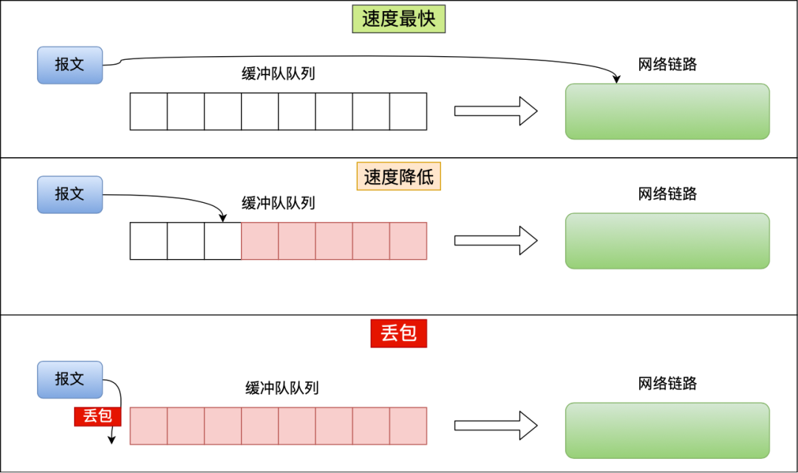

上图中三种情况：

- 当缓冲队列为空时，传输速度最快；
- 当缓冲队列开始有报文挤压，那么网速就开始变慢了，也就是网络延时变高了；
- 当缓冲队列溢出时，就出现了丢包现象。

传统的拥塞控制算法就是在第三步这个时间点进入拥塞避免阶段，显然已经很晚了。

其实进行拥塞控制的最佳时间点，是缓冲队列刚出现积压的时刻，也就是第二步。

Google 推出的 **BBR 算法是以测量带宽、时延来确定拥塞的拥塞控制算法**，能提高网络环境的质量，减少网络延迟和降低丢包率。

Linux 4.9 版本之后都支持 BBR 算法，开启 BBR 算法的方式：

```text
net.ipv4.tcp_congestion_control=bbr
```

这里的每一个知识都涉及到了计算机网络，这就是**计算机网络之美**！

## 总结

掌握好数据结构与算法，才能设计出高效的宕机判断算法，本文我们采用哈希表 + 双向链表实现了类 LRU 算法。

掌握好计算组成 + 操作系统，才能设计出高性能的架构，本文我们采用多线程模式来充分利用 CPU 资源，还需要考虑 IO 多路服用的选择，锁的选择，消息队列的引入，内存分配器的选择等等。

掌握好计算机网络，才能选择契合场景的传输协议，如果心跳包长度大于 MTU，那么选择 TCP 更有利，但是 TCP 是个复杂的协议，在高并发的场景下，需要对 TCP的每一个阶段需要优化。如果如果心跳包长度小于 MTU，且不要求可靠传输时，UDP 协议是更好的选择。

怎么样？

是不是感动到了计算机基础之美。