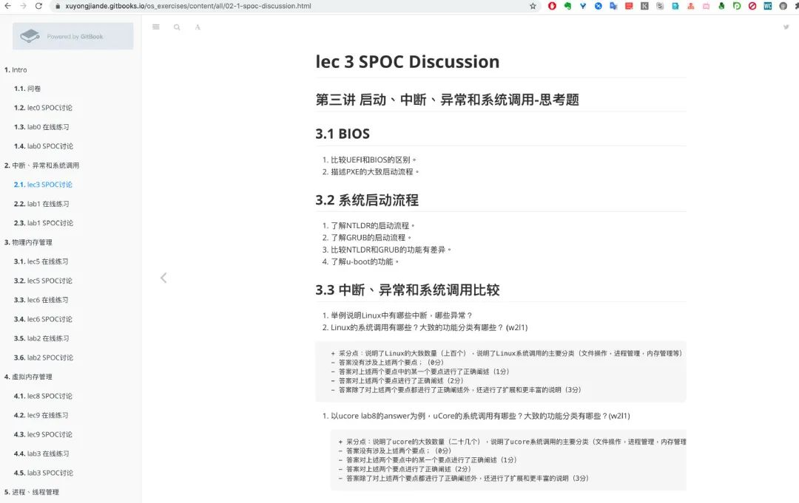
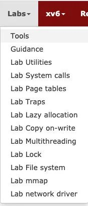
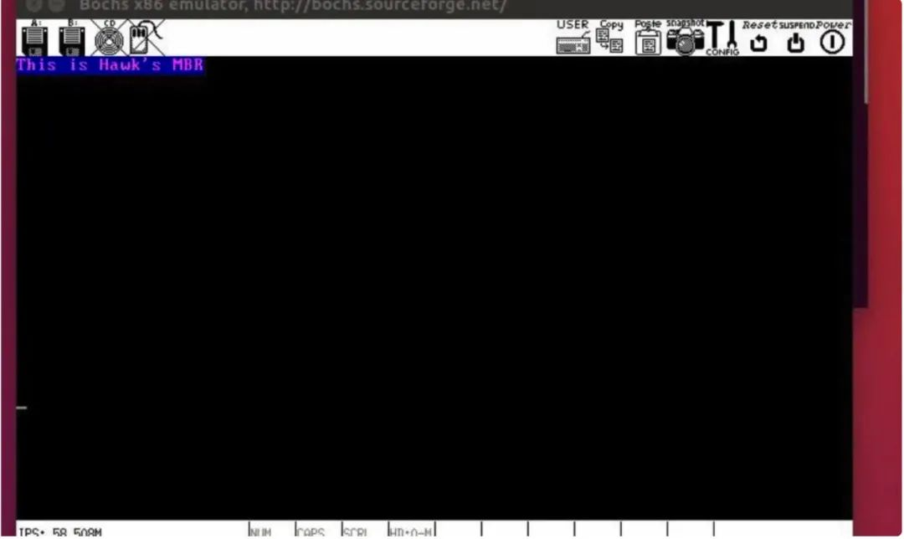

今天单独讨论下，如何学习操作系统这个话题。

操作系统发展到今天，已经非常复杂了，像 Windows、Linux 任意一个都是几千万行代码级别，想靠个人完全搞懂，几乎是不可能的了。

所以需要先明确一下我们学习的目的，不同的学习目的，适用不同的方法，这里我仅仅列一下作为一名开发人员，我们掌握 OS 的几种目标：

## **第一种：**

知晓 OS 基本概念：看在线课程原理部分的视频或者看《现代操作系统》之类的书，可大致知道OS的概念；

## **第二种：**

理解OS基本原理: 在1的基础上，完成与 OS 相关的课程练习题，可进一步理解 OS 基本原理，练习题可以参考学堂在线清华OS课程的练习题：

## **第三种：**

掌握 OS 部分核心功能实现（细节）：在 2 的基础上，能够通过编程完成类似  xv6 的几个 lab ，

比如 xv6 就会涉及以下模块：

- Booting a PC
- Memory Management
- Multitasking
- File system, Spawn and Shell
- Network Driver

每个模块代码量都不会很多，但是麻雀虽小，五脏俱全，通过自己动手实现 thread、spinlock、semaphore 这些东西，会让你理解更加深刻。

当然，在往上走就是去研究最新 Linux Kernel，研究一些子模块了，有些还需要阅读最新的 System 领域论文。

最新的 Linux Kernel  里有很多新的算法、研究结果不断的加入。

当然，这就超出了我所能掌握的范畴了哈哈。

不过说实话，如果你还在校大二大三，我真的墙裂建议你去做一些国外的计算机 lab，比如OS、Network。

等到毕业了，几乎就不太可能从头开始系统学习那些基础知识了，除非你能自己闭关两三年，啥也不做，待在一个地方专心修炼。

好好珍惜在学校大把的空闲时间，做一些让在专业上让自己受益一生的事情。

这里我可以列举几个，国内不少喜欢 System 的同学都会去跟 MIT、CMU、UCB 这些计算机名校的课程。

比如 MIT 的 **6.824 Distributed System**、**6.830 Database Systems**、**MIT 6.828 Operating System Engineering** .....

## xv6

6.828 就是今天要介绍的主角：

MIT6.828：Operating System Engineering

官网主页：`https://pdos.csail.mit.edu/6.828/2020/index.html`

在官网，包含了Schedule、Labs、xv6-book 等等。

尤其是 xv6-lab 包含了操作系统中最为核心的模块：

每个模块都搭好了框架，留下最为核心的部分给我们去实现，你可以把这个看做一种「完形填空」：

- System Call、Page tables
- Traps
- Lazy allocation、Copy On-Write
- Multithreading、Lock
- File System、mmpa
- network driver

如果想看视频的话可以去 Youtube 或者 B站：

MIT 6.828: Operating System Engineering ：`https://www.bilibili.com/video/BV1px411E7ST`

## ucore

如果你想找一个国内的类似 xv6 的 lab，那么这里推荐清华大学 ucore OS。

它其实也是起源于MIT CSAIL PDOS课题组开发的 xv6 & jos、哈佛大学开发的 OS161教学操作系统、以及Linux-2.4 内核。

然后清华的老师在这个基础上，增加、调整了一些代码，为清华大学 OS 课程设计的一个lab。

另外，这个课程的很多资料、文档都是中文的，还有清华老师的配套视频课程。

清华大学-操作系统：`https://www.xuetangx.com/course/THU08091000267/5883104`

顺便推荐几本经典的书籍吧:

> 书名（英文）：Operating Systems : Design and Implementation (3rd Edition)
>
> 书名（中文）：操作系统：设计及实现 (第三版)
>
> 原作者：Andrew S. Tanenbaum / Albert S. Woodhull
>
> 翻译者：王鹏、尤晋元、朱鹏、敖青云

> Operating System (操作系统)
>
> 书名（英文）：Operating System Concepts (7th Edition)
>
> 书名（中文）：操作系统概念 (第七版)
>
> 原作者：Abraham Silberschatz / Peter Baer Galvin / Greg Gagne

另外还有诸如《现代操作系统》、《Operating Systems: Three Easy Pieces》之类的。

尤其是 《Operating Systems: Three Easy Pieces》，阅读体验比较好，讨论问题由浅入深。

而书名也是很有意思，`Three Easy Piece`是为了致敬费曼的关于物理学的书籍：《Six Easy Pieces: Essentials Of Physics Explained By Its Most Brilliant Teacher》。

用作者的话说，操作系统只有物理学一半难，那就叫 《Three Easy Pieces》好了。

Three 也是指代本书三个部分：

- 虚拟化（**Virtualization**）
- 并发（**Concurrency**）
- 持久化（**Persistence**）

操作系统这门课，易学难精，但是掌握到日常编程和面试够用还是比较容易的。

那么毕业生或者说你去准备校招面试应该达到怎样的水平:

- OS 四大模块的理论知识: 进程与线程管理、内存管理、IO与文件系统、设备管理
- 了解 Linux 内核部分实现原理，如内存管理、进程管理、虚拟文件系统等
- 了解和熟悉常用的系统调用已经 System API

其中内存、进程、IO 是重点，这几块也是和编程关系最密切的，这里推荐先挑本偏理论的书看看，了解操作系统的全貌：

- 《现代操作系统》
- 《操作系统—精髓与设计原理》

不必全看，两者任选一本都不错，我自己是仔细看了第二本，因为是我们教材，同时挑着看了现代操作系统部分章节。

## 操作系统包含的知识

这部分看完你应该对下面这些话题有一个清晰认知了：

- 操作系统由哪些构成
- 进程的状态、切换、调度
- 进程间通信方式（共享内存、管道、消息）
- 进程和线程的区别
- 线程的实现方式（一对一、多对一等）
- 互斥与同步（信号量、管程、锁）
- 死锁检测与避免
- 并发经典的问题：读者写者、哲学家就餐问题
- 为什么需要虚拟内存，MMU 具体如何做地址转换的
- 内存为什么分段、分页
- 页面置换算法
- 文件系统是如何组织的
- 虚拟文件系统（VFS）是如何抽象的
- ...

但是这还不够，看完偏理论的书，当面试官问「进程和线程的区别」时。

大概只能回答出「进程是资源分配的最小单位，线程是CPU调度的最小单位，balabala...」这样正确却普通的答案。

但是如果你了解 Linux 内核的实现，就可以实际出发，讲讲 Linux 中进程和线程是如何创建的，区别在哪里。

比如在 Linux 中进程和线程实际上都是用一个结构体 `task_struct`来表示一个执行任务的实体。进程创建调用`fork` 系统调用，而线程创建则是 `pthread_create` 方法，但是这两个方法最终都会调用到 `do_fork` 来做具体的创建操作 ，区别就在于传入的参数不同。

深究下去，你会发现 Linux 实现线程的方式简直太巧妙了，实际上根本没有**线程**，它创建的就是进程，只不过通过参数指定多个进程之间共享某些资源（如虚拟内存、页表、文件描述符等），函数调用栈、寄存器等线程私有数据则独立。

这样是不是非常符合理论书上的定义：同一进程内的多个线程共享该进程的资源，但线程并不拥有资源，只是使用他们。

这也算符合 Unix 的哲学了— KISS（Keep It Simple, Stupid）。

但是在其它提供了专门线程支持的系统中，则会在进程控制块（PCB）中增加一个包含指向该进程所有线程的指针，然后再每个线程中再去包含自己独占的资源。

这算是非常正统的实现方式了，比如 Windows 就是这样干的。

但是相比之下 Linux 就显得取巧很多，也很简洁。

对于进程、线程这块你还可以把 fork、vfork、clone 、pthread_create 这些模块关系彻底搞清楚，对你理解 Linux 下的进程实现有非常大的帮助。

说了这么多，就是想强调一下理论联系实际的重要性。

特别是操作系统，最好的实践就是看下 Linux 内核是怎么实现的，当然不是叫你直接去啃 Linux 源码，那不是一般人能掌握的。

最好的方式是看书，书的脉络给你理得很清晰。

书籍推荐：

- 《Linux内核设计与实现》

> 这本书恰到好处，即讲清楚了内核实现的要点，又不会通篇源码。

这本书重点关注「第 3 章进程管理」、「第 5 章系统调用」、「第12章内存管理」、「第13章虚拟文件系统」、「第 15 章进程地址空间」

这些章节属于操作系统核心部分，其它如中断处理、块 IO、设备管理根据你自己兴趣选择看下就可以了。

基本上做到这里，操作系统就没什么大问题了。

## 自制OS

另外，如果你还想自己写一个（模仿） mini os，那么你需要一些前置依赖知识，否则估计会被很多硬件、汇编知识劝退：

- **筑基内功**-- 需要学习计算机原理、C语言（需要熟练运用）、数据结构课程
- **工欲善其事，必先利其器，掌握以下Linux 下常用命令行：**

> pwd、cd、find等，1-2 款趁手的编辑器，推荐掌握 vim 的基本操作
>
> gcc、gdb、ld、make等编译构建链、objdump、nm、readif、dd 等 ELF 文件分析、烧录工具。

这里只推荐一本我看过的书《操作系统真象还原》，作者实在太好了，所有需要前置依赖的部分他都会简单的写个教程，照着这本书就能撸一个属于自己的 os。

这部分大家感兴趣就自己去看好了，在公众号发自制 OS 文章，我觉得不太合适，因为实在太多细节了，公众号不适合做这样的教程。

截取其中一部分读者也会看得云里雾里，纯碎作者自嗨。

关于自制 OS 后面可以单独写一篇文章~

------

好了，自学 OS 部分就到这里了。