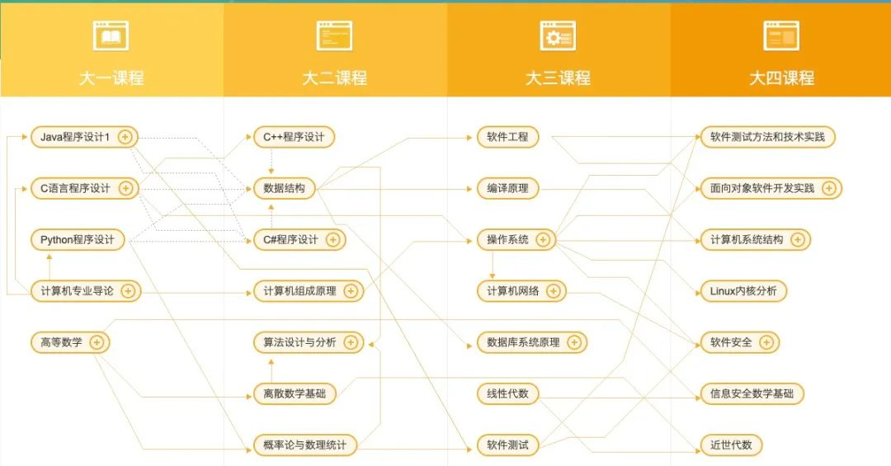

今天来和大家聊聊计算机人应该如何高质量地走完大学四年。下面将我在大学四年走过的那些经验分享与你，让你站在未来看现在的自己。 

如果笔者以现在的心态重回大一，我一定按照下面的路线学习。

这个问题也可以看成：如何规划自己的大学四年？ 

那么既然是规划，必然得从目标出发，有了目标才能明确方向。

**前言**

前言主要聊聊明确好目标， 那么如何明确目标呢？

其实绝大部分刚进入大学的同学都是非常迷茫的，笔者也是这样，刚进入大一的时候，虽然有比较强烈的学习欲望，但是却不知道为什么要学习，努力学习是为了达到一个什么样的水平？别的同学都是打游戏，我是不是也应该跟他们一样整天玩乐？大学是真的就不用学习了吗？这些问题都是笔者当时所遇到的，或许你也会遇到，

当时非常有幸参与了某位学长的经验分享，一下子就茅塞顿开有目标了。

在这里，我想以一位过来人的身份将自己的经历完全分享给你，希望对你有所启发。我们这里讨论的明确目标不讨论读研还是工作，到底是读研还是工作，其实这是一个值得认真做决策的事情，这里我们只讨论一个目标：提高自己的计算机水平并且热爱上它。 

为什么说只讨论这个目标呢？ 

因为你已经是一个计算机人了，不管是出于什么原因选择计算机专业的，你已经加入其中来了，选择面对而不要逃避。所以请认真提高计算机水平且热爱上它，这不管对于你大四考研还是工作面试，都是必须的。 

那么，又有一个疑问来了，提高自己的计算机水平到一个什么样的水平呢？ 

**第一：能够掌握计算机世界里常见的数据结构与算法且能随时手写实现。（算法）** 

**第二：能够非常详细且清楚形象地解释一行行代码是如何被计算机执行起来的。（编译、链接、运行）** 

**第三：能够非常清楚多台计算机之间是如何通信的（网络）** 

**第四：能够非常清楚我们这些信息数据是如何存储的 （数据库，准确来说它也属于应用范畴）**

能够很好的掌握以上四个问题，基本上计算机的基础知识已经基本理解了。

别看只有四个问题，其实这四个问题相互牵扯、联系，涉及范围很广。

好了，目标已然明确，那就开始做行动的巨人吧。

进入主题之前需要明确一点： **一定要学会自学编程！一定要学会自学编程！！一定要学会自学编程！！**

### 课程体系

下面是网易云课堂的计算机学生培养体系，语言主要集中在C/C++/java/python 然后是一些基础知识。

这张图汇聚了很多大佬的经验，不敢随意点评。 

这里是随意说一点：**大学期间学习的编程语言在于精，而不在于多。** 

除了上图编程语言过多之外，可以看出在计算机基础理论方面比较重视，所以我们重点以C/C++来谈谈计算机基础理论知识。

下面的学什么，主要围绕计算机体系展开，没有包括大学里必修的一些课程，必修课程也是必须要学习的，比如离散数学，数电模电等，这也会为你在计算机路上提供很大的帮助。

**把这些知识融会贯通，毕业你就能进大厂，加以刷题练习，你就能在考研专业课中得高分。**

### 大一

### 主要学什么？

大一这一年，非常简单，你就应该学习数据结构和算法以及C/c++语言。然后一直不断地做算法题，不管你是不是有想法、有机会参加ACM校队（如果能够参加，强烈建议参加），大一这一年持续刷题和学习数据结构就行了，有机会有条件就去参加蓝桥杯（不要说它很水，先拿到省一，然后去北京打国赛再说），努力拿到省一的水平，基本上基础算法也就掌握了，不要考虑去做前端那么炫酷的页面等等应用开发，当然如果你非常有兴趣，可以花少部分精力去尝试。

 为什么需要把数据结构与算法的基础打牢呢？ 

第一：不管是你大四面试还是考研，做算法题和写数据结构题都是必须的。 

第二：数据结构与算法是整个计算机基础理论的基石，基础不牢，地动山摇。 

第三：数据结构与算法很大程度上不牵扯到其他计算机知识，比较容易上手和深入。 

第四：你能够积累代码量，这为你以后开发应用做了最好的铺垫。

### 如何学？

第一步：如果没有C语言基础，首先学习c语言基本的语法、语句，写一些简单的程序，打印三角形之类的，多写一些简单的程序，这个是主要熟悉C语言的特性以及编程入门。 

第二步：选择杭电oj开始做题，网上有很多新手做题的顺序，具体如何操作可以自行百度（学会搜索也是计算机人所必须具备的能力）。 

第三步：杭电oj基础题大概做到100道差不多了，这期间肯定会遇到一些简单的算法问题，比如冒泡排序等等，开始学习算法的基本知识，比如时空复杂度等等。 

第四步：算法的基本知识学完了，你学会衡量一个算法的快慢了，那么接下来你可以开始进攻数据结构了，把基础数据结构都自己实现一遍。 

第五步：基础数据结构与算法都学习差不多了，开始进入算法攻坚，这里主要是竞赛中比较基础的算法，比如：DP、DFS、BFS等等了。 

第六步：基础算法学习完了之后，如果对ACM比较有兴趣，强烈建议加入去参加竞赛，具体ACM的算法网上有很多总结，也包括知识点总结等等，将ACM的基础竞赛算法都学习一篇。 

第七步：利用已学的数据结构和算法，做一个整体的C语言系统，可以把所学习的算法和数据结构整合到一起，形成一个小系统总结。最后学习github使用，将小系统代码提交到github上。 

第八步：如果还有余力，建议开始啃算法导论这本黑书。

**以上步骤，写代码过程中，一定不要自欺欺人抄袭模板，所有代码都要自己编写，并且是通过理解之后的编写，以便于你比赛或者面试信手拈来。**

到这里，你已经可以很好的回答开篇中提到的第一个问题了。

下面是推荐的相关书籍： 

C语言入门： 谭浩强《C语言入门到精通》 

数据结构: 《大话数据结构》 

算法: 《挑战程序设计竞赛》 《算法竞赛》《算法导论》

### 大二

从大一暑假就算进入大二了

### 主要学什么？

大二这一年在大一的基础上把C++深入进攻，建立以C++为核心的知识体系。 

为什么是C++，而不是Java、Python? 

首先明确不是说Java、Python不行，是因为C++更接近计算机硬件，它能够让你更加深刻理解并切身体会计算机体系的精髓，仅因为C的精髓——指针，粗略理解指针就是内存地址，那么如何理解内存，下面的知识就来了。

预备知识：汇编语言（8086汇编）&C/C++相关语言特性 

汇编语言作为了预备的知识，因为做了那么多道题，写了那么多C代码，学习汇编这种低级语言，会容易上手了，这也会后续学习打下铺垫，这里推荐是8086汇编，因为8086汇编是CPU在实模式下工作，是最简单的一种了，学习嘛，从简单到复杂。 汇编语言让你体验CPU指令式的编程。

第一门课：计算机组成原理 

这是掌握计算机组成的重要课程，你必须得掌握它才能理解计算机的运行原理，组成原理等，前期开始学习，你会比较痛苦，因为过于抽象，这也是公认非常难的一门课，笔者在整个大学四年，这门课的分数最低，拿下它，看到另一片风景。

第二门课：操作系统 

操作系统不用说了，这也是必须要开始掌握的，掌握好操作系统，你才能知道你在大一那一年写了那么多exe文件，是如何运行的，操作系统又是如何调度硬件设备的，这也是一门开始学习非常难的课，不过爬过了计算机组成原理的坑，这里会好不少。 

第三门课：编译原理 

为什么第三门课是编译原理，因为只有掌握了这个，你才能理解你写的#include<stdio.h> 这类语句被转化成了什么，最后又是什么。这门课，笔者老师说是大学里最难的一门，因为设计到太多的数学推到等等，不过这里你掌握大概的理论就差不多了，计算机领域数学上面的知识，不是做研究的，很少有机会用到。 到这里你可以回答开篇提到的第二个问题了，你就能理解**「一个程序是如何跑起来的了」**

第四门课：计算机网络 

计算机网络是连接多台计算机从而衍生出来的一个计算机体系分支，你在学习的时候抓住一条主线学习 **「数据包是如何发送出去的」**，你把这个问题弄清楚，计算机网络体系的知识也就掌握差不多了。也能回答第三个问题，计算机是如何通信的了。

第五门课：数据库原理 

一般学校也会在大二开设这门课，跟着老师学习就可以了，因为你目前没有涉及到应用开发，应用起来也比较无从下手，所以跟着学校老师的实验一个个做完，然后深入理解其中的原理，比如索引、事物等概念原理。 这里你就能回答第四个问题了。

### 如何学习？

首先，这类理论课往往很枯燥，很难集中精力理解学习，又或者说学习了又忘，无法深刻理解其本质，前面提到了预备知识汇编语言，那么就从汇编语言和C/C++下手吧，C/C++已经写了很多代码了，比较熟悉了，关键是汇编语言，才接触，又是各类指令符号，太难了！！！其实不难，汇编语言其实简单，他就是靠指令堆积起来的程序，没啥好可怕的，学习好它相关的寄存器知识就可以开始学指令了，学习过程中，最主要的是做实验！！！ 一定要动手！！！ 动手起来，最好是跟着视频教程一起学习。 

学习了汇编，你会第一次接触到硬件编程，你会操作CPU的寄存器、你会接触总线。这里就为计算机组成原理学习打下铺垫了。

到了计算机组成原理，建议跟着视频来一起学习，网上有很多讲的比较好的视频，这里又考验大家的信息搜集以及甄别能力了。 其实这块，你主要理解计算机的各大部件是干嘛的，以及是如何工作的，能够理解明白就算是入门了。

到了操作系统这块，跟之前一样跟着视频一起学习。这里你就会明白一个程序到底是如何运行的。主要掌握，系统初始化、进程管理、内存管理、文件系统等模块的知识。 

然后是编译原理，编译原理这门课从理论来讲其实还是比较好入门的，笔者当初就是在图书馆借了本清华大学的书在看，然后就入门了。到编译原理这门课，你应该开始养成看书的习惯了，看视频的不好的地方就是非常容易忘记。学习完编译原理，你掌握了源码如何构建成产物了，这样你的知识就连贯起来了，你能够结合计算机组成体系以及操作系统还有编译原理三门课讲清楚第二个问题了。

然后是计算机网络、数据库，上面都提到了。

最后，为了大学学习有亮点，你可以写一个小型的C编译器或者json解释器等等，加深对编译原理的理解。

**这些小型的项目都可以作为你建立里面的加分项，这非常能力体现你的学习以及动手能力，企业&研究生不就是需要这种人吗？**

下面是推荐的书籍： 

汇编语言：这块笔者是跟着教材学习的，没有买书就不推荐了！ 

《深入理解计算机系统》这本书涵盖了整个计算机体系知识，认真阅读这本书，就可以连贯上面前三门课的知识 。

其他一些书籍也可以结合起来看： 《程序员自我修养》《现代操作系统》《自制脚本语言》《深入理解C指针》《C++ Primer》《图解 HTTP》《计算机网络：自顶向下方法》

以上提到的四个问题都能回答了，恭喜你，计算机的基础体系知识以及差不多掌握了，接下来就是要深入挖掘了，给自己的简历添加亮点。用实际项目证明自己的能力。

### 大三上

### 主要学习什么

大三上你就主要研究liunx系统吧，前面你已经有C/C++做的一些小项目经验了，那么这个时候利用熟悉的C/C++，你可以开始研究Liunx系统内核了。 

为什么这里推荐深入Liunx? 

原因有很多：Liunx源码开放，直接看源码理解CPU任务调度、进程线程如何表示等等；Liunx又是工作或者读研必定会用到的，提前准备何尝不可呢；面试的时候与面试官对吹Liunx内核，你还能面试不过？

有很多原因，这里就不一一例举了。

### 如何学习？

首先，探究Liunx底层原理最好的办法就是把它跑起来，参考Liunx以及其他操作系统架构，做一个微内核，一边理解，一边撸内核，比如系统初始化的时候，Liunx到底初始化了一些什么东西？ 你自己的微内核也需要初始化，这样你就非常清楚Liunx系统初始化的时候是在干什么了。初始化完了之后，你需要对CPU进行操作，就需要进程管理，你手写的进程管理代码，肯定比不上Liunx的进程管理代码，但是重点就在于，你自己实现了一遍，这个印象是非常深刻的。

 等你实现玩一个微内核之后，你就会感叹原来操作系统，自己也能实现。不过这个过程异常艰难。这就是简历中的亮点。艰难是因为操作系统本身非常抽象，然后还要自己实现一个，国内的操作系统都做得不出色。

总结下来就是，一边学习Liunx源码，一边自己实现微内核。 

推荐书籍： 《深入Liunx内核架构》《Liunx内核源码分析》

### 收尾

为什么写到大三上就不写了，因为大学给计算机专业同学学习打基础的时间就是这么多了。大三下，你可能会选择春招实习或者考研复习。找到实习之后，基本上你就已经踏入社会开始实习了，当然你会选择不实习而留在学校，享受校园生活，这也无可厚非。大三下开始，你根本很难有时间去学习了。

**最后你也可以发现，大学其实****表面上是4年，其实只有两年半，那么也就是这两年半的时间，你要在计算机领域中度过从零到一。**说到这里，你是不是突然觉得时间紧迫了。不得不承认，计算机的知识非常抽象，如果你不潜心学习，很难度过从零到一，甚至你到毕业了还不能完整的理解上面提到的那些计算机体系内容。

### 总结

笔者在学校做了很多应用类项目，其实在面试的时候根本没有核心竞争力，可以说大学里面做的那些页面、crud项目绝大部分都太水，无法吸引面试官的眼球，所以直接放弃吧，不要被炫酷的页面所迷倒，现在的轮子太多，github随手拿一个。

那么如何有核心竞争力呢？

就是上面提到的，**一个计算机人所必须具备的基本素养，你得明白，你写的每一行代码在计算机在中是什么样子，它是如何执行的，它会耗费多少CPU资源等，这很难，也很酷，不是吗？**

### 最后

  期待正在阅读的你，认认真真走完大学四年，并学有所成。