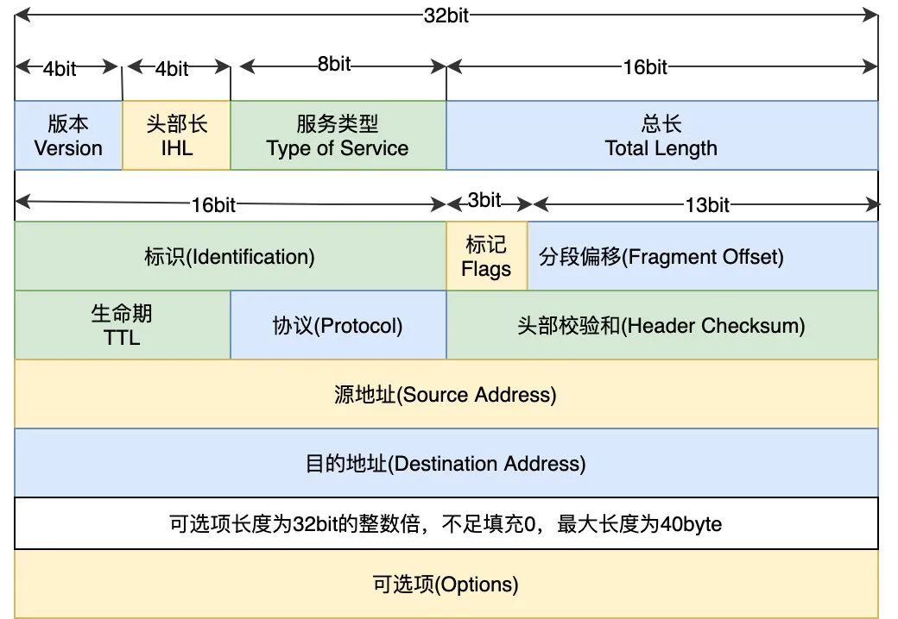
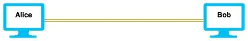

摄影嘛，等我有点经验再来分享分享，先给大家聊聊关于计算机网络的一些学习体会。

首先从一道经典面试题开始：

**在浏览器输入一个 URL，到网页显示出来，中间发生了什么 ？**

不知道小伙伴们面试被问过这个问题么？

这个问题其实在《Computer Networking: A Top-Down Approach》这本书的末尾花了十几页的篇幅完整的描述过。

如果你还是无法很清晰的说出其中过程，那就说明还需要去补课哈。

当然了，不同岗位的同学可能关注的重点会不一样，前端同学可能更关注 HTTP、浏览器网络请求、渲染过程，后台同学则更关注网络层和传输层。

我们暂时不写这个问题的具体答案是什么，先聊聊如何学习计算机网络。

不少初学的小伙伴，在学习计网过程中，特别容易陷入一个误区：

**挨个的背下每一个网络协议的作用，头部字段以及通信双方的交互过程。**

比如这个 IP 数据包的头部：

IP头部格式

花了好大的力气，终于背完了 HTTP、TCP、IP、ARP、DHCP 等一堆协议。

最后还是说不清数据包是如何在网络世界传输的。

这是多么大的悲伤呀！

所以学习计网一定不要完全去死记硬背，不然就会今天记、明天忘。

我们要明白，网络存在的目的就是解决主机之间的通信问题。

最简单的，我们可以直接将两台主机通过网线连接：

点对点直连

这个时候是不需要什么 IP 协议、ARP 之类的东西，

但是随着越来的越多的主机加入，会遇到如何寻址、数据包发送冲突等问题。

为了解决这些问题，我们引入了 MAC 地址、ARP、IP 这些协议。

从问题出发，按照 **Why -> How -> What**  这样的顺序。

先谈遇到了什么问题，再说如何去解决，最终才是搬出前辈们的 RFC 文档，这样就会顺畅很多。

而且这是在引导我们去思考如何解决问题，从点对点连接开始如何构造一个网络。

如果一上来就搬出原理，比如 TCP 连接管理、状态转换、超时重传、IP 包如何分段与重组这样的东西，我觉得是比较懵逼的。

作为初学者我们并不太清楚为什么需要这样做，不这样做行不行？

以前学计网的时候，我也有一堆的困惑：

比如路由器和交换机有什么区别？

为什么有了 MAC 地址还要 IP 地址呢？

只用 IP 地址行不行呢？

如何理解广播域和冲突域？

大家有过这些问题么？

如果你脑海里对这些问题的答案非常的清晰，那么恭喜你，你对网络掌握得还不错！

网络世界分层极其明显，所以教材包括教学方式一般分为两类：

- 自顶向下
- 自底向上

当然了，学习其它东西也是同理，只不过分层的感觉可能没有计网这么强烈。

我们大学老师就是从应用层开始往下讲的，自顶向下的好处是直观，上层的直观感受会让你有探索下层实现的欲望。

我们教材也恰好使用的是《计算机网络-自顶向下》这本经典的计算机网络书籍，这本书也是采取自顶向下这样的讲述方式。

按照网络的五层模型，从我们日常接触的应用层往下依次把网络的面纱解开。

当然了，国内也有不少高校是以自底向上的方式上课的，一上来就是一堆的物理层、链路层协议，典型教材如《Computer Networks, Fourth Edition》。

我个人其实也是很喜欢这种方式的，自底向上也有其独特的魅力。

独特在哪？

因为自顶向下是一层层的从外向内打开，然而最初设计网络的时候肯定不可能是自顶向下的吧。

真实的世界一定是自底向上演变的，不可能先定义了 HTTP 协议再去考虑如何设计传输层，这显然不合理嘛。

网络的演变一定是最初有两台电脑互相通信的需求，然后是多台电脑，他们之间构成了局域网，再往后局域网之间组成了广域网。

最关键的是，自底向上是解决问题导向，比如有了 IP层 为什么还需要传输层呢？

我们都知道一台电脑可能有多个进程在使用网络连接，那么当 IP 包到达主机时，怎么区分这是发给哪个进程的呢？

操作系统为了能够区分数据是传给上层哪个应用的，才引入了传输层。

这是自底向上解决问题的过程。

但是自顶向下可能就是学完应用层，直接告诉你，下一层是传输层，然后接着讲 TCP 和 UDP 是什么。

比如在《自顶向下》第三章讲传输层的时候，是这样开篇的:

> 运输层位于应用层和网络层之间，是分层的网络体系结构的重要部分。该层为运行在不同主机上的应用进程提供直接的通信服务起着至关重要的作用。我们在本章采用的教学方法是，交替地讨论运输层的原理和这些原理在现有的协议中是如何实现的。与往常一 样，我们将特别关注因特网协议，即 TCP 和 UDP 运输层协议。

那我可能就会想，为什么在应用层和网络层之间需要运输层，直接把应用数据包打包在网络层里发送出去不行吗？

当然可以，只要给每个应用分配一个唯一的ID，一起放在网络层的数据包发送出去，接收方使用这个 ID 来定位数据是给哪个应用的。

其实你也看出来了，这就是把 TCP、UDP 做的事情放在了 IP 层去做。

所以为了保持 IP 层的灵活性和功能独立，这里引入了传输层，这就是分层。

分层这个思想在计算机世界中非常重要，你可以在任何地方看到它的身影。

计算机领域有一句名言：

> 计算机科学领域的任何问题都可以通过增加一个间接的中间层来解决

学习计网过程中也需要建立结构化的思维，最直观的结构就是按照计网的层次来，即：应用层、传输层、网络层、数据链路层、物理层。

然后在去学习每个层的功能和其中的每个协议，这个过程既可以自顶而下，也可以自底向上。

**分层学习过程中除了要掌握每一层之外，最重要的其实是要学习层与层之间是如何链接起来的，比如 IP 层和数据链路层就是 ARP 协议。**

最后当你学完所有的协议后，再回顾一下，一个数据包是如何从 send() 函数发送出去的。

离散的 IP 数据包又是如何抽象出“面向连接”的 TCP 层，并且要清晰的认识到这里的连接是一种逻辑状态，建立、断开连接则是同步双方的通信状态。

基于这样的认识，才能轻易的回答出类似：“TCP连接建立后出现服务器崩溃、断电、网线被拔...会发生什么情况”这样的问题。

**呃呃呃，现在似乎有点晚了，本来想继续写下关于计算机网络学习资源，这次就先简单推荐下了，下次补齐：**

书籍：

入门：《网络是怎么连接的》、《图解 TCP/IP 》

深入学习：《计算机网络：自顶向下》、《TCP/IP 卷一》

官方：RFC 文档（这是计算机网络的协议标准文档）

抓包：《Wireshark 网络分析就这么简单》，这本书写得很幽默风趣，可以看看。

源码：之前看了一个pdf《tcp源码分析》：

网课：哈工大的计算机网络，B站自取~

国外经典课程：CS144，这门课的视频其实并不突出，一般般吧，但是 Assignment/Lab 挺有意思的，用 C++ 实现一个 TCP，当然了不会像 linux 中网络协议栈那么复杂，但是麻雀虽小五脏俱全。

网络编程：做一些网络工具：聊天室、p2p

简单网络攻击：比如去玩玩 ARP 攻击，在寝室或者你们家里搞点“网络攻击”

我觉得学习计网，做点网络编程、简单网络攻击、抓包，会让学习更加有趣，我当时是这几个都玩了下，你对这些网络协议的认识就会更加深刻的。

你好，我是小北，毕业于某末流985，前国外计算机公开课硬核 Lab 玩家，现微信后台小开发。

高中编程 0 基础，从小白到计算机，大三时通过实习和外包收入 10 W+，[**点击蓝字查看我的「编程能力突飞猛进之路」**。](https://mp.weixin.qq.com/s?__biz=Mzg4NjUxMzg5MA==&mid=2247486207&idx=1&sn=6342507ac5b6e14e3542f6fede7d9b3d&scene=21#wechat_redirect)

日常分享高质量文章，输出面试、CS 学习、工作经验，有一个可能是最好的「CS学习星球」： [**点击了解小北的知识星球**](https://mp.weixin.qq.com/s?__biz=Mzg4NjUxMzg5MA==&mid=2247490463&idx=1&sn=b19a33cfaf29ce59daa30a16905db87b&scene=21#wechat_redirect)